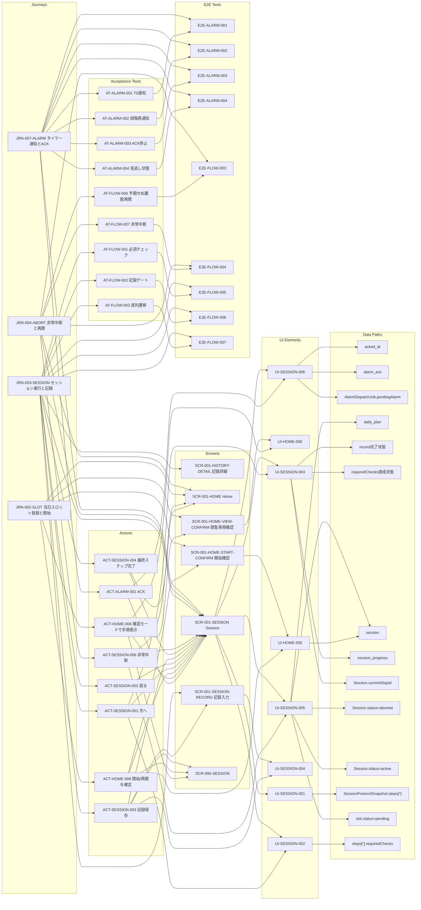

# SCR-001-SESSION マップ

```mermaid
flowchart LR
  %% SCR-001-SESSION
  subgraph JRN["Journeys"]
    N41["JRN-002-SLOT 当日スロット登録と開始"]
    N42["JRN-003-SESSION セッション進行と記録"]
    N43["JRN-004-ABORT 非常中断と再開"]
    N44["JRN-007-ALARM タイマー通知とACK"]
  end
  subgraph ACT["Actions"]
    N1["ACT-ALARM-001 ACK"]
    N2["ACT-HOME-006 確認モードで手順表示"]
    N3["ACT-HOME-008 開始/再開を確定"]
    N4["ACT-SESSION-001 次へ"]
    N5["ACT-SESSION-002 戻る"]
    N6["ACT-SESSION-003 記録保存"]
    N7["ACT-SESSION-004 最終ステップ完了"]
    N8["ACT-SESSION-006 非常中断"]
  end
  subgraph SCR["Screens"]
    N45["SCR-001-HISTORY-DETAIL 記録詳細"]
    N46["SCR-001-HOME Home"]
    N47["SCR-001-HOME-START-CONFIRM 開始確認"]
    N48["SCR-001-HOME-VIEW-CONFIRM 閲覧専用確認"]
    N49["SCR-001-SESSION Session"]
    N50["SCR-001-SESSION-RECORD 記録入力"]
    N51["SCR-006-SESSION"]
  end
  subgraph UI["UI Elements"]
    N52["UI-HOME-005"]
    N53["UI-HOME-006"]
    N54["UI-SESSION-001"]
    N55["UI-SESSION-002"]
    N56["UI-SESSION-003"]
    N57["UI-SESSION-004"]
    N58["UI-SESSION-005"]
    N59["UI-SESSION-006"]
  end
  subgraph AT["Acceptance Tests"]
    N9["AT-ALARM-001 T0通知"]
    N10["AT-ALARM-002 段階再通知"]
    N11["AT-ALARM-003 ACK停止"]
    N12["AT-ALARM-004 見逃し状態"]
    N13["AT-FLOW-001 必須チェック"]
    N14["AT-FLOW-002 記録ゲート"]
    N15["AT-FLOW-003 直列遷移"]
    N16["AT-FLOW-006 予期せぬ離脱再開"]
    N17["AT-FLOW-007 非常中断"]
  end
  subgraph E2E["E2E Tests"]
    N32["E2E-ALARM-001"]
    N33["E2E-ALARM-002"]
    N34["E2E-ALARM-003"]
    N35["E2E-ALARM-004"]
    N36["E2E-FLOW-003"]
    N37["E2E-FLOW-004"]
    N38["E2E-FLOW-005"]
    N39["E2E-FLOW-006"]
    N40["E2E-FLOW-007"]
  end
  subgraph DATA["Data Paths"]
    N18["acked_at"]
    N19["alarm_ack"]
    N20["AlarmDispatchJob.pendingAlarm"]
    N21["daily_plan"]
    N22["record完了状態"]
    N23["requiredChecks達成状態"]
    N24["session"]
    N25["session_progress"]
    N26["Session.currentStepId"]
    N27["Session.status=aborted"]
    N28["Session.status=active"]
    N29["SessionProtocolSnapshot.steps[*]"]
    N30["slot.status=pending"]
    N31["steps[*].requiredChecks"]
  end
  N1 --> N49
  N1 --> N59
  N2 --> N48
  N2 --> N49
  N2 --> N51
  N2 --> N53
  N3 --> N47
  N3 --> N49
  N3 --> N51
  N3 --> N52
  N4 --> N49
  N4 --> N55
  N4 --> N56
  N5 --> N49
  N6 --> N49
  N6 --> N50
  N6 --> N51
  N6 --> N57
  N7 --> N46
  N7 --> N49
  N8 --> N46
  N8 --> N49
  N8 --> N58
  N9 --> N32
  N10 --> N33
  N11 --> N34
  N12 --> N35
  N13 --> N38
  N14 --> N39
  N15 --> N40
  N16 --> N36
  N17 --> N37
  N41 --> N2
  N41 --> N3
  N41 --> N46
  N41 --> N47
  N41 --> N48
  N42 --> N4
  N42 --> N5
  N42 --> N6
  N42 --> N7
  N42 --> N13
  N42 --> N14
  N42 --> N15
  N42 --> N38
  N42 --> N39
  N42 --> N40
  N42 --> N45
  N42 --> N49
  N42 --> N50
  N43 --> N8
  N43 --> N16
  N43 --> N17
  N43 --> N36
  N43 --> N37
  N43 --> N46
  N43 --> N49
  N44 --> N1
  N44 --> N9
  N44 --> N10
  N44 --> N11
  N44 --> N12
  N44 --> N32
  N44 --> N33
  N44 --> N34
  N44 --> N35
  N44 --> N49
  N47 --> N52
  N48 --> N53
  N49 --> N54
  N49 --> N55
  N49 --> N56
  N49 --> N58
  N49 --> N59
  N50 --> N57
  N52 --> N24
  N54 --> N29
  N55 --> N31
  N56 --> N22
  N56 --> N23
  N56 --> N25
  N56 --> N26
  N58 --> N21
  N58 --> N24
  N58 --> N27
  N58 --> N28
  N58 --> N30
  N59 --> N18
  N59 --> N19
  N59 --> N20
```

