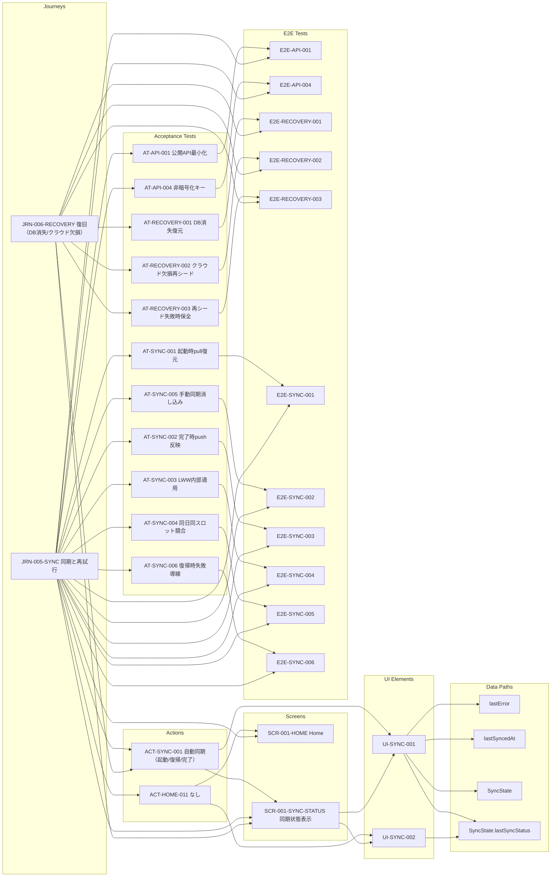

# SCR-001-SYNC-STATUS マップ

```mermaid
flowchart LR
  %% SCR-001-SYNC-STATUS
  subgraph JRN["Journeys"]
    N29["JRN-005-SYNC 同期と再試行"]
    N30["JRN-006-RECOVERY 復旧（DB消失/クラウド欠損）"]
  end
  subgraph ACT["Actions"]
    N1["ACT-HOME-011 なし"]
    N2["ACT-SYNC-001 自動同期（起動/復帰/完了）"]
  end
  subgraph SCR["Screens"]
    N31["SCR-001-HOME Home"]
    N32["SCR-001-SYNC-STATUS 同期状態表示"]
  end
  subgraph UI["UI Elements"]
    N33["UI-SYNC-001"]
    N34["UI-SYNC-002"]
  end
  subgraph AT["Acceptance Tests"]
    N3["AT-API-001 公開API最小化"]
    N4["AT-API-004 非暗号化キー"]
    N5["AT-RECOVERY-001 DB消失復元"]
    N6["AT-RECOVERY-002 クラウド欠損再シード"]
    N7["AT-RECOVERY-003 再シード失敗時保全"]
    N8["AT-SYNC-001 起動時pull復元"]
    N9["AT-SYNC-002 完了時push反映"]
    N10["AT-SYNC-003 LWW内部適用"]
    N11["AT-SYNC-004 同日同スロット競合"]
    N12["AT-SYNC-005 手動同期消し込み"]
    N13["AT-SYNC-006 復帰時失敗導線"]
  end
  subgraph E2E["E2E Tests"]
    N18["E2E-API-001"]
    N19["E2E-API-004"]
    N20["E2E-RECOVERY-001"]
    N21["E2E-RECOVERY-002"]
    N22["E2E-RECOVERY-003"]
    N23["E2E-SYNC-001"]
    N24["E2E-SYNC-002"]
    N25["E2E-SYNC-003"]
    N26["E2E-SYNC-004"]
    N27["E2E-SYNC-005"]
    N28["E2E-SYNC-006"]
  end
  subgraph DATA["Data Paths"]
    N14["lastError"]
    N15["lastSyncedAt"]
    N16["SyncState"]
    N17["SyncState.lastSyncStatus"]
  end
  N1 --> N31
  N1 --> N34
  N2 --> N32
  N2 --> N33
  N3 --> N18
  N4 --> N19
  N5 --> N20
  N6 --> N21
  N7 --> N22
  N8 --> N23
  N9 --> N25
  N10 --> N26
  N11 --> N27
  N12 --> N24
  N13 --> N28
  N29 --> N1
  N29 --> N2
  N29 --> N3
  N29 --> N4
  N29 --> N8
  N29 --> N9
  N29 --> N10
  N29 --> N11
  N29 --> N12
  N29 --> N13
  N29 --> N18
  N29 --> N19
  N29 --> N23
  N29 --> N24
  N29 --> N25
  N29 --> N26
  N29 --> N27
  N29 --> N28
  N29 --> N31
  N29 --> N32
  N30 --> N2
  N30 --> N5
  N30 --> N6
  N30 --> N7
  N30 --> N20
  N30 --> N21
  N30 --> N22
  N30 --> N32
  N32 --> N33
  N32 --> N34
  N33 --> N14
  N33 --> N15
  N33 --> N16
  N33 --> N17
  N34 --> N17
```

