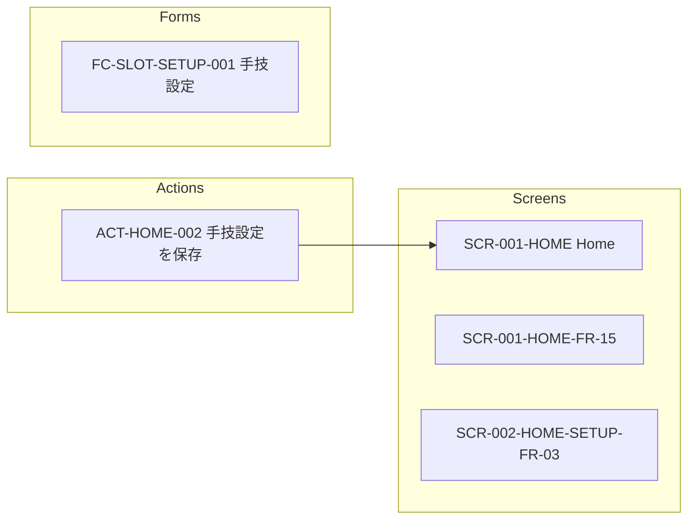

# SCR-002-HOME-SETUP-FR-03 マップ

```mermaid
flowchart LR
  %% SCR-002-HOME-SETUP-FR-03
  subgraph ACT["Actions"]
    N1["ACT-HOME-002 手技設定を保存"]
  end
  subgraph SCR["Screens"]
    N3["SCR-001-HOME Home"]
    N4["SCR-001-HOME-FR-15"]
    N5["SCR-002-HOME-SETUP-FR-03"]
  end
  subgraph FC["Forms"]
    N2["FC-SLOT-SETUP-001 手技設定"]
  end
  N1 --> N3
```

