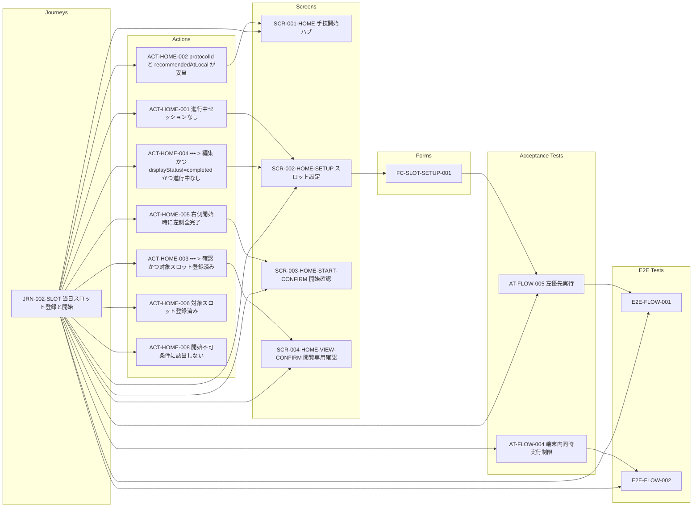

# SCR-002-HOME-SETUP マップ

```mermaid
flowchart LR
  %% SCR-002-HOME-SETUP
  subgraph JRN["Journeys"]
    N13["JRN-002-SLOT 当日スロット登録と開始"]
  end
  subgraph ACT["Actions"]
    N1["ACT-HOME-001 進行中セッションなし"]
    N2["ACT-HOME-002 protocolId と recommendedAtLocal が妥当"]
    N3["ACT-HOME-003 ••• > 確認 かつ対象スロット登録済み"]
    N4["ACT-HOME-004 ••• > 編集 かつdisplayStatus!=completed かつ進行中なし"]
    N5["ACT-HOME-005 右側開始時に左側全完了"]
    N6["ACT-HOME-006 対象スロット登録済み"]
    N7["ACT-HOME-008 開始不可条件に該当しない"]
  end
  subgraph SCR["Screens"]
    N14["SCR-001-HOME 手技開始ハブ"]
    N15["SCR-002-HOME-SETUP スロット設定"]
    N16["SCR-003-HOME-START-CONFIRM 開始確認"]
    N17["SCR-004-HOME-VIEW-CONFIRM 閲覧専用確認"]
  end
  subgraph FC["Forms"]
    N12["FC-SLOT-SETUP-001"]
  end
  subgraph AT["Acceptance Tests"]
    N8["AT-FLOW-004 端末内同時実行制限"]
    N9["AT-FLOW-005 左優先実行"]
  end
  subgraph E2E["E2E Tests"]
    N10["E2E-FLOW-001"]
    N11["E2E-FLOW-002"]
  end
  N1 --> N15
  N2 --> N14
  N3 --> N17
  N4 --> N15
  N5 --> N16
  N8 --> N11
  N9 --> N10
  N12 --> N9
  N13 --> N1
  N13 --> N2
  N13 --> N3
  N13 --> N4
  N13 --> N5
  N13 --> N6
  N13 --> N7
  N13 --> N8
  N13 --> N9
  N13 --> N10
  N13 --> N11
  N13 --> N14
  N13 --> N15
  N13 --> N16
  N13 --> N17
  N15 --> N12
```

