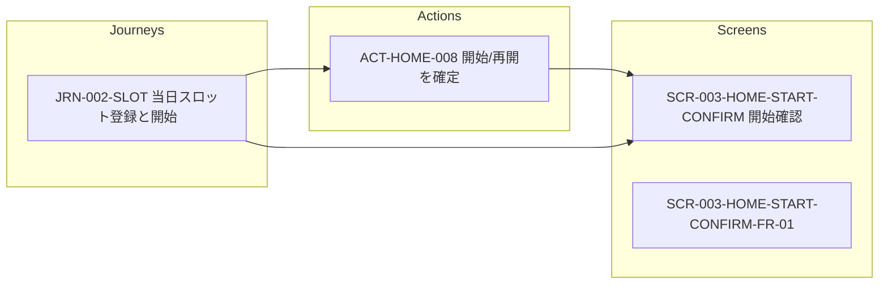

# SCR-003-HOME-START-CONFIRM-FR-01 マップ

```mermaid
flowchart LR
  %% SCR-003-HOME-START-CONFIRM-FR-01
  subgraph JRN["Journeys"]
    N2["JRN-002-SLOT 当日スロット登録と開始"]
  end
  subgraph ACT["Actions"]
    N1["ACT-HOME-008 開始/再開を確定"]
  end
  subgraph SCR["Screens"]
    N3["SCR-003-HOME-START-CONFIRM 開始確認"]
    N4["SCR-003-HOME-START-CONFIRM-FR-01"]
  end
  N1 --> N3
  N2 --> N1
  N2 --> N3
```

