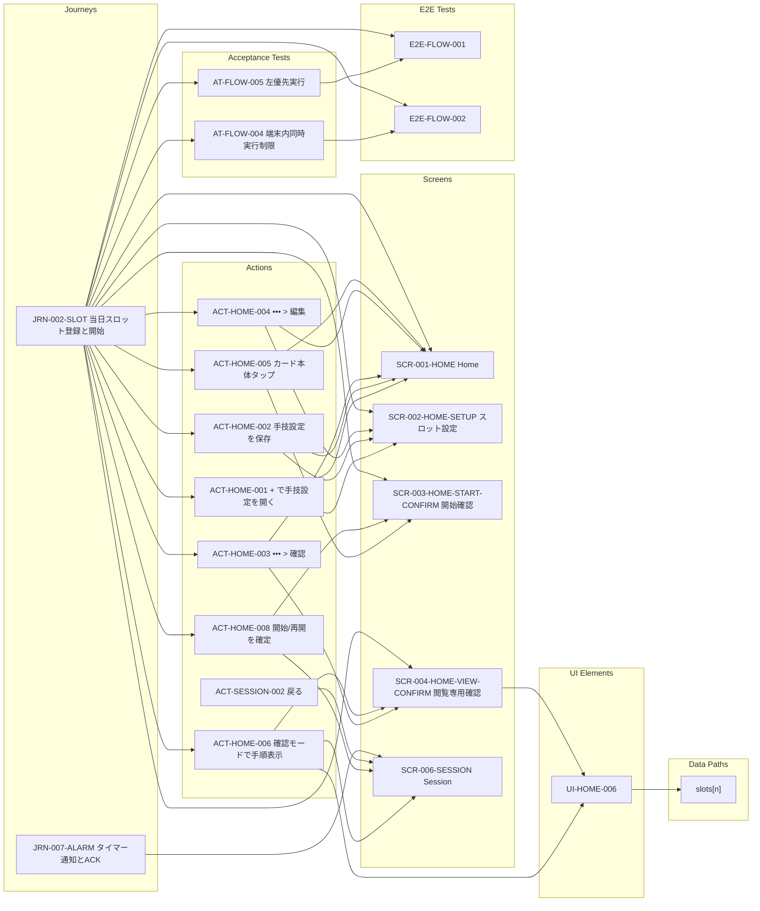

# SCR-004-HOME-VIEW-CONFIRM マップ

```mermaid
flowchart LR
  %% SCR-004-HOME-VIEW-CONFIRM
  subgraph JRN["Journeys"]
    N14["JRN-002-SLOT 当日スロット登録と開始"]
    N15["JRN-007-ALARM タイマー通知とACK"]
  end
  subgraph ACT["Actions"]
    N1["ACT-HOME-001 + で手技設定を開く"]
    N2["ACT-HOME-002 手技設定を保存"]
    N3["ACT-HOME-003 ••• > 確認"]
    N4["ACT-HOME-004 ••• > 編集"]
    N5["ACT-HOME-005 カード本体タップ"]
    N6["ACT-HOME-006 確認モードで手順表示"]
    N7["ACT-HOME-008 開始/再開を確定"]
    N8["ACT-SESSION-002 戻る"]
  end
  subgraph SCR["Screens"]
    N16["SCR-001-HOME Home"]
    N17["SCR-002-HOME-SETUP スロット設定"]
    N18["SCR-003-HOME-START-CONFIRM 開始確認"]
    N19["SCR-004-HOME-VIEW-CONFIRM 閲覧専用確認"]
    N20["SCR-006-SESSION Session"]
  end
  subgraph UI["UI Elements"]
    N21["UI-HOME-006"]
  end
  subgraph AT["Acceptance Tests"]
    N9["AT-FLOW-004 端末内同時実行制限"]
    N10["AT-FLOW-005 左優先実行"]
  end
  subgraph E2E["E2E Tests"]
    N12["E2E-FLOW-001"]
    N13["E2E-FLOW-002"]
  end
  subgraph DATA["Data Paths"]
    N11["slots[n]"]
  end
  N1 --> N16
  N1 --> N17
  N2 --> N16
  N2 --> N17
  N3 --> N16
  N3 --> N19
  N4 --> N16
  N4 --> N17
  N5 --> N16
  N5 --> N18
  N6 --> N19
  N6 --> N20
  N6 --> N21
  N7 --> N18
  N7 --> N20
  N8 --> N20
  N9 --> N13
  N10 --> N12
  N14 --> N1
  N14 --> N2
  N14 --> N3
  N14 --> N4
  N14 --> N5
  N14 --> N6
  N14 --> N7
  N14 --> N9
  N14 --> N10
  N14 --> N12
  N14 --> N13
  N14 --> N16
  N14 --> N17
  N14 --> N18
  N14 --> N19
  N15 --> N20
  N19 --> N21
  N21 --> N11
```

