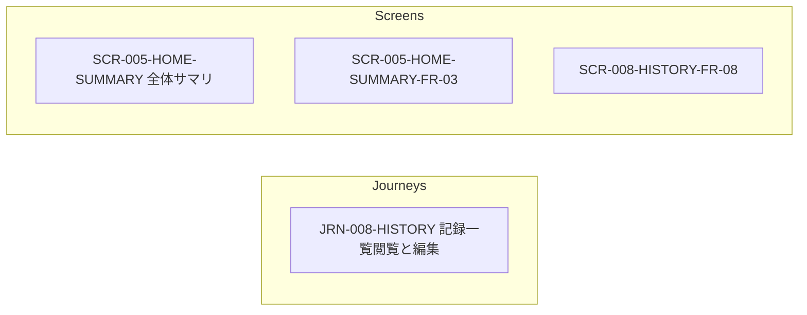

# SCR-005-HOME-SUMMARY-FR-03 マップ

```mermaid
flowchart LR
  %% SCR-005-HOME-SUMMARY-FR-03
  subgraph JRN["Journeys"]
    N1["JRN-008-HISTORY 記録一覧閲覧と編集"]
  end
  subgraph SCR["Screens"]
    N2["SCR-005-HOME-SUMMARY 全体サマリ"]
    N3["SCR-005-HOME-SUMMARY-FR-03"]
    N4["SCR-008-HISTORY-FR-08"]
  end
```

