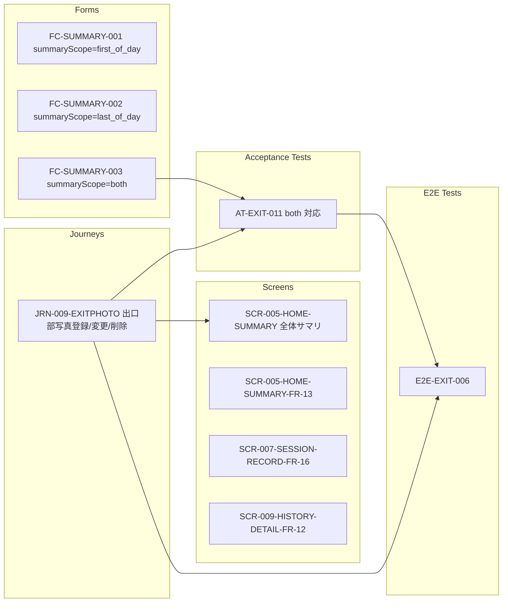

# SCR-005-HOME-SUMMARY-FR-13 マップ

```mermaid
flowchart LR
  %% SCR-005-HOME-SUMMARY-FR-13
  subgraph JRN["Journeys"]
    N6["JRN-009-EXITPHOTO 出口部写真登録/変更/削除"]
  end
  subgraph SCR["Screens"]
    N7["SCR-005-HOME-SUMMARY 全体サマリ"]
    N8["SCR-005-HOME-SUMMARY-FR-13"]
    N9["SCR-007-SESSION-RECORD-FR-16"]
    N10["SCR-009-HISTORY-DETAIL-FR-12"]
  end
  subgraph FC["Forms"]
    N3["FC-SUMMARY-001 summaryScope=first_of_day"]
    N4["FC-SUMMARY-002 summaryScope=last_of_day"]
    N5["FC-SUMMARY-003 summaryScope=both"]
  end
  subgraph AT["Acceptance Tests"]
    N1["AT-EXIT-011 both 対応"]
  end
  subgraph E2E["E2E Tests"]
    N2["E2E-EXIT-006"]
  end
  N1 --> N2
  N5 --> N1
  N6 --> N1
  N6 --> N2
  N6 --> N7
```

