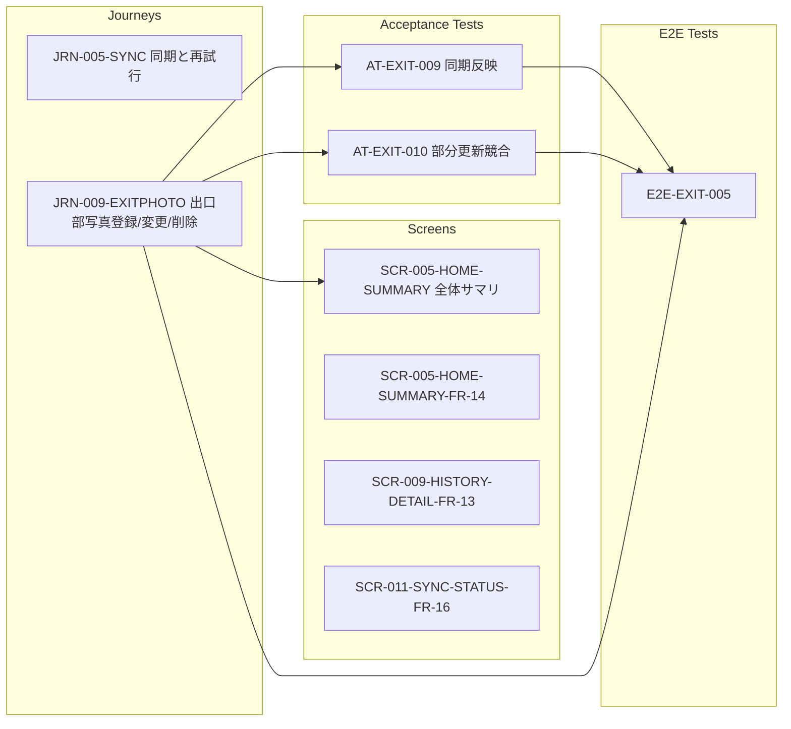

# SCR-005-HOME-SUMMARY-FR-14 マップ

```mermaid
flowchart LR
  %% SCR-005-HOME-SUMMARY-FR-14
  subgraph JRN["Journeys"]
    N4["JRN-005-SYNC 同期と再試行"]
    N5["JRN-009-EXITPHOTO 出口部写真登録/変更/削除"]
  end
  subgraph SCR["Screens"]
    N6["SCR-005-HOME-SUMMARY 全体サマリ"]
    N7["SCR-005-HOME-SUMMARY-FR-14"]
    N8["SCR-009-HISTORY-DETAIL-FR-13"]
    N9["SCR-011-SYNC-STATUS-FR-16"]
  end
  subgraph AT["Acceptance Tests"]
    N1["AT-EXIT-009 同期反映"]
    N2["AT-EXIT-010 部分更新競合"]
  end
  subgraph E2E["E2E Tests"]
    N3["E2E-EXIT-005"]
  end
  N1 --> N3
  N2 --> N3
  N5 --> N1
  N5 --> N2
  N5 --> N3
  N5 --> N6
```

