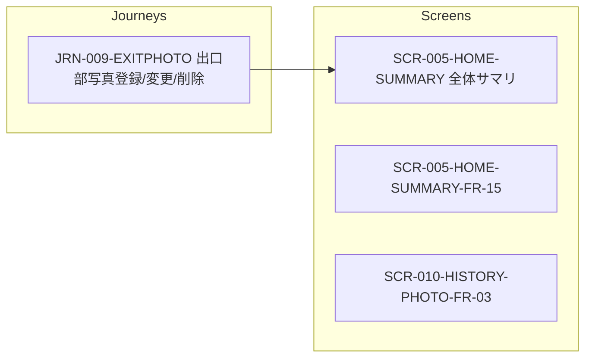

# SCR-005-HOME-SUMMARY-FR-15 マップ

```mermaid
flowchart LR
  %% SCR-005-HOME-SUMMARY-FR-15
  subgraph JRN["Journeys"]
    N1["JRN-009-EXITPHOTO 出口部写真登録/変更/削除"]
  end
  subgraph SCR["Screens"]
    N2["SCR-005-HOME-SUMMARY 全体サマリ"]
    N3["SCR-005-HOME-SUMMARY-FR-15"]
    N4["SCR-010-HISTORY-PHOTO-FR-03"]
  end
  N1 --> N2
```

