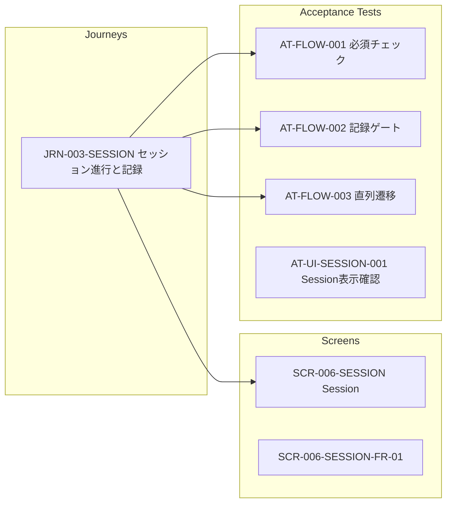

# SCR-006-SESSION-FR-01 マップ

```mermaid
flowchart LR
  %% SCR-006-SESSION-FR-01
  subgraph JRN["Journeys"]
    N5["JRN-003-SESSION セッション進行と記録"]
  end
  subgraph SCR["Screens"]
    N6["SCR-006-SESSION Session"]
    N7["SCR-006-SESSION-FR-01"]
  end
  subgraph AT["Acceptance Tests"]
    N1["AT-FLOW-001 必須チェック"]
    N2["AT-FLOW-002 記録ゲート"]
    N3["AT-FLOW-003 直列遷移"]
    N4["AT-UI-SESSION-001 Session表示確認"]
  end
  N5 --> N1
  N5 --> N2
  N5 --> N3
  N5 --> N6
```

