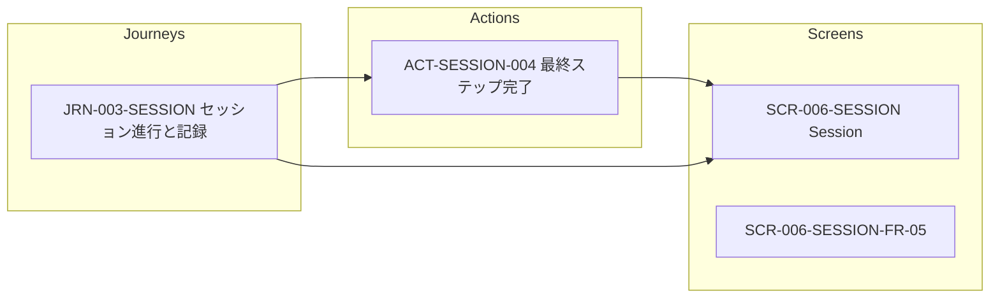

# SCR-006-SESSION-FR-05 マップ

```mermaid
flowchart LR
  %% SCR-006-SESSION-FR-05
  subgraph JRN["Journeys"]
    N2["JRN-003-SESSION セッション進行と記録"]
  end
  subgraph ACT["Actions"]
    N1["ACT-SESSION-004 最終ステップ完了"]
  end
  subgraph SCR["Screens"]
    N3["SCR-006-SESSION Session"]
    N4["SCR-006-SESSION-FR-05"]
  end
  N1 --> N3
  N2 --> N1
  N2 --> N3
```

