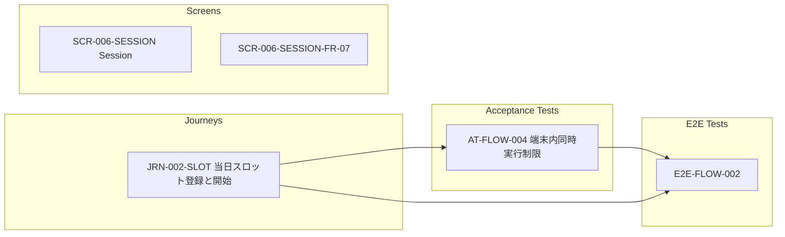

# SCR-006-SESSION-FR-07 マップ

```mermaid
flowchart LR
  %% SCR-006-SESSION-FR-07
  subgraph JRN["Journeys"]
    N3["JRN-002-SLOT 当日スロット登録と開始"]
  end
  subgraph SCR["Screens"]
    N4["SCR-006-SESSION Session"]
    N5["SCR-006-SESSION-FR-07"]
  end
  subgraph AT["Acceptance Tests"]
    N1["AT-FLOW-004 端末内同時実行制限"]
  end
  subgraph E2E["E2E Tests"]
    N2["E2E-FLOW-002"]
  end
  N1 --> N2
  N3 --> N1
  N3 --> N2
```

