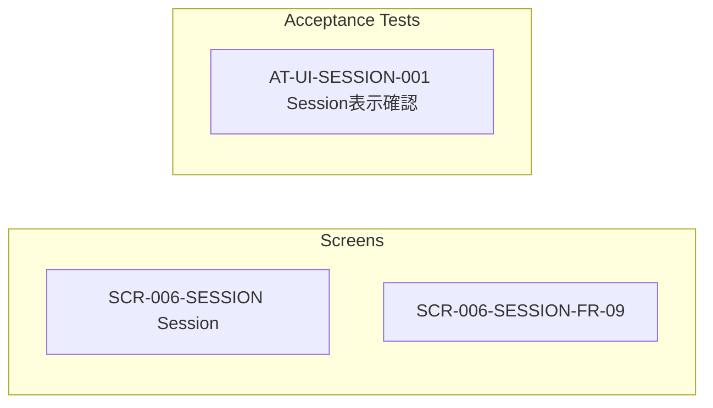

# SCR-006-SESSION-FR-09 マップ

```mermaid
flowchart LR
  %% SCR-006-SESSION-FR-09
  subgraph SCR["Screens"]
    N2["SCR-006-SESSION Session"]
    N3["SCR-006-SESSION-FR-09"]
  end
  subgraph AT["Acceptance Tests"]
    N1["AT-UI-SESSION-001 Session表示確認"]
  end
```

