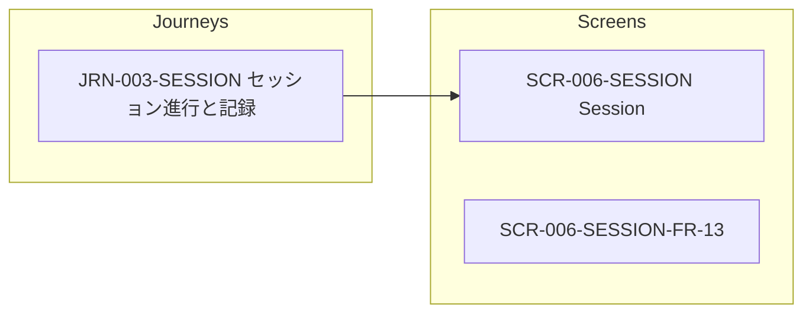

# SCR-006-SESSION-FR-13 マップ

```mermaid
flowchart LR
  %% SCR-006-SESSION-FR-13
  subgraph JRN["Journeys"]
    N1["JRN-003-SESSION セッション進行と記録"]
  end
  subgraph SCR["Screens"]
    N2["SCR-006-SESSION Session"]
    N3["SCR-006-SESSION-FR-13"]
  end
  N1 --> N2
```

