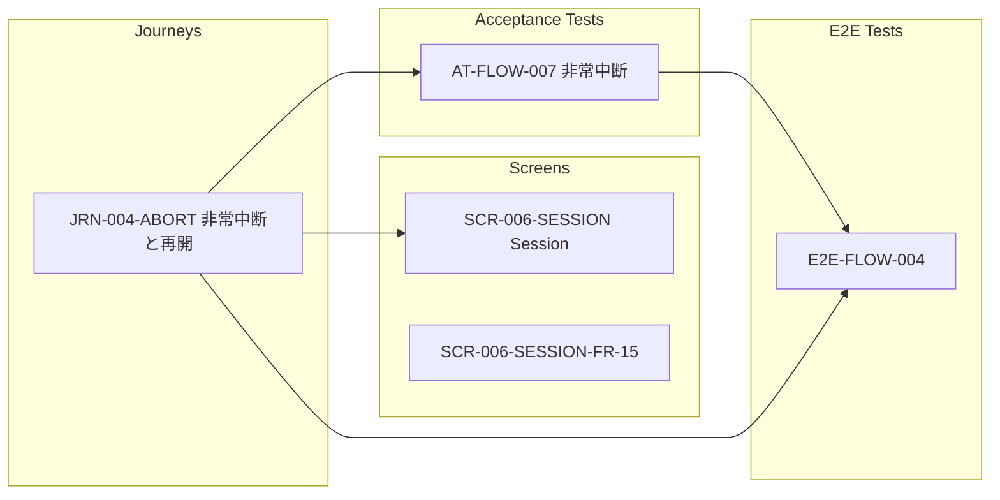

# SCR-006-SESSION-FR-15 マップ

```mermaid
flowchart LR
  %% SCR-006-SESSION-FR-15
  subgraph JRN["Journeys"]
    N3["JRN-004-ABORT 非常中断と再開"]
  end
  subgraph SCR["Screens"]
    N4["SCR-006-SESSION Session"]
    N5["SCR-006-SESSION-FR-15"]
  end
  subgraph AT["Acceptance Tests"]
    N1["AT-FLOW-007 非常中断"]
  end
  subgraph E2E["E2E Tests"]
    N2["E2E-FLOW-004"]
  end
  N1 --> N2
  N3 --> N1
  N3 --> N2
  N3 --> N4
```

