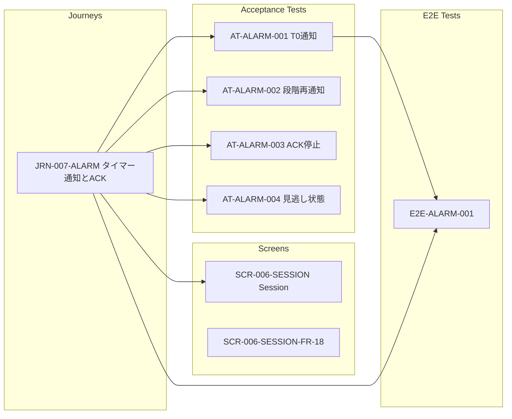

# SCR-006-SESSION-FR-18 マップ

```mermaid
flowchart LR
  %% SCR-006-SESSION-FR-18
  subgraph JRN["Journeys"]
    N6["JRN-007-ALARM タイマー通知とACK"]
  end
  subgraph SCR["Screens"]
    N7["SCR-006-SESSION Session"]
    N8["SCR-006-SESSION-FR-18"]
  end
  subgraph AT["Acceptance Tests"]
    N1["AT-ALARM-001 T0通知"]
    N2["AT-ALARM-002 段階再通知"]
    N3["AT-ALARM-003 ACK停止"]
    N4["AT-ALARM-004 見逃し状態"]
  end
  subgraph E2E["E2E Tests"]
    N5["E2E-ALARM-001"]
  end
  N1 --> N5
  N6 --> N1
  N6 --> N2
  N6 --> N3
  N6 --> N4
  N6 --> N5
  N6 --> N7
```

