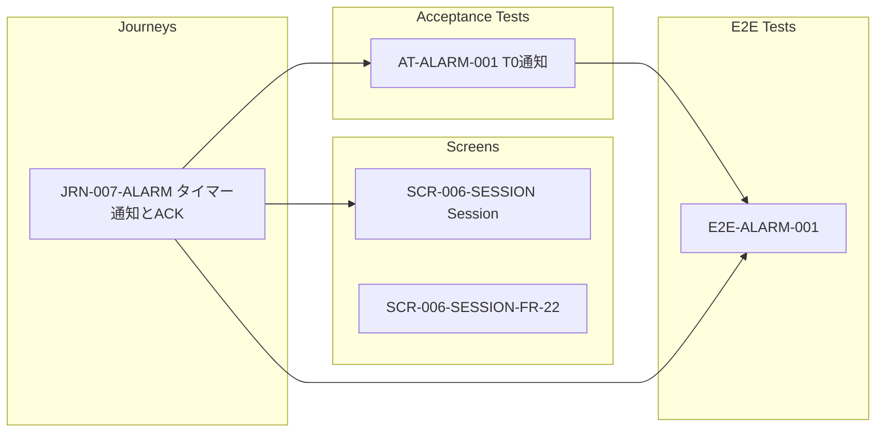

# SCR-006-SESSION-FR-22 マップ

```mermaid
flowchart LR
  %% SCR-006-SESSION-FR-22
  subgraph JRN["Journeys"]
    N3["JRN-007-ALARM タイマー通知とACK"]
  end
  subgraph SCR["Screens"]
    N4["SCR-006-SESSION Session"]
    N5["SCR-006-SESSION-FR-22"]
  end
  subgraph AT["Acceptance Tests"]
    N1["AT-ALARM-001 T0通知"]
  end
  subgraph E2E["E2E Tests"]
    N2["E2E-ALARM-001"]
  end
  N1 --> N2
  N3 --> N1
  N3 --> N2
  N3 --> N4
```

