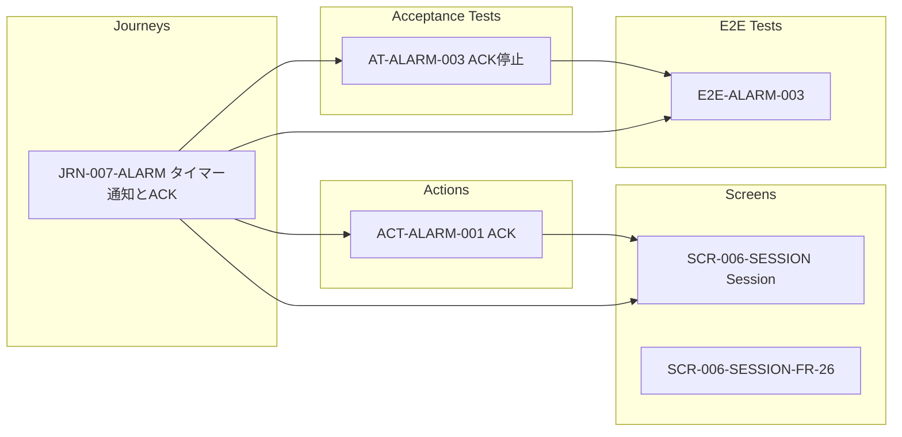

# SCR-006-SESSION-FR-26 マップ

```mermaid
flowchart LR
  %% SCR-006-SESSION-FR-26
  subgraph JRN["Journeys"]
    N4["JRN-007-ALARM タイマー通知とACK"]
  end
  subgraph ACT["Actions"]
    N1["ACT-ALARM-001 ACK"]
  end
  subgraph SCR["Screens"]
    N5["SCR-006-SESSION Session"]
    N6["SCR-006-SESSION-FR-26"]
  end
  subgraph AT["Acceptance Tests"]
    N2["AT-ALARM-003 ACK停止"]
  end
  subgraph E2E["E2E Tests"]
    N3["E2E-ALARM-003"]
  end
  N1 --> N5
  N2 --> N3
  N4 --> N1
  N4 --> N2
  N4 --> N3
  N4 --> N5
```

