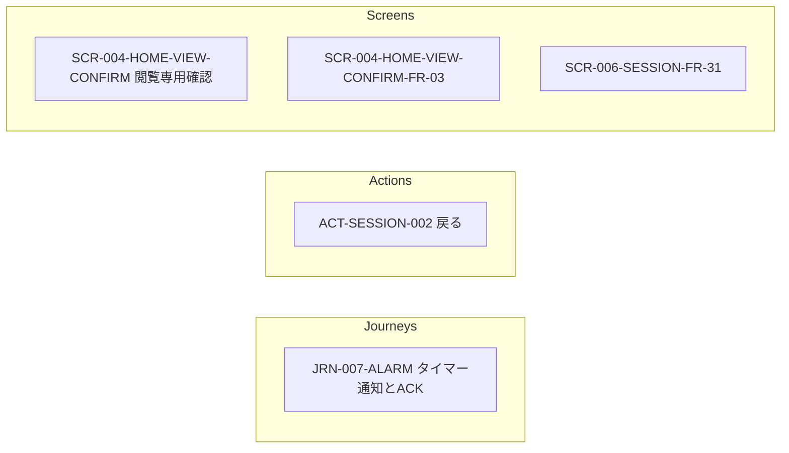

# SCR-006-SESSION-FR-31 マップ

```mermaid
flowchart LR
  %% SCR-006-SESSION-FR-31
  subgraph JRN["Journeys"]
    N2["JRN-007-ALARM タイマー通知とACK"]
  end
  subgraph ACT["Actions"]
    N1["ACT-SESSION-002 戻る"]
  end
  subgraph SCR["Screens"]
    N3["SCR-004-HOME-VIEW-CONFIRM 閲覧専用確認"]
    N4["SCR-004-HOME-VIEW-CONFIRM-FR-03"]
    N5["SCR-006-SESSION-FR-31"]
  end
```

