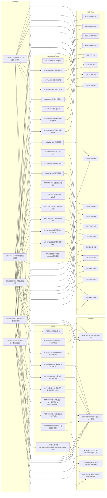

# SCR-006-SESSION マップ

```mermaid
flowchart LR
  %% SCR-006-SESSION
  subgraph JRN["Journeys"]
    N48["JRN-002-SLOT 当日スロット登録と開始"]
    N49["JRN-003-SESSION セッション進行と記録"]
    N50["JRN-004-ABORT 非常中断と再開"]
    N51["JRN-005-SYNC 同期と再試行"]
    N52["JRN-007-ALARM タイマー通知とACK"]
  end
  subgraph ACT["Actions"]
    N1["ACT-ALARM-001 未ACKジョブあり"]
    N2["ACT-HOME-006 対象スロット登録済み"]
    N3["ACT-HOME-008 開始不可条件に該当しない"]
    N4["ACT-HOME-011 なし"]
    N5["ACT-SESSION-001 必須チェック完了かつrecord_event完了"]
    N6["ACT-SESSION-002 先頭ステップ以外"]
    N7["ACT-SESSION-003 FC-* 必須条件充足"]
    N8["ACT-SESSION-004 最終ステップ到達"]
    N9["ACT-SESSION-006 確認ダイアログ承認"]
    N10["ACT-SYNC-001 startup/resume/session_complete/manual 契機"]
  end
  subgraph SCR["Screens"]
    N53["SCR-001-HOME 手技開始ハブ"]
    N54["SCR-006-SESSION セッション進行"]
    N55["SCR-007-SESSION-RECORD 記録入力"]
    N56["SCR-009-HISTORY-DETAIL 記録詳細"]
    N57["SCR-011-SYNC-STATUS 同期状態表示"]
  end
  subgraph AT["Acceptance Tests"]
    N11["AT-ALARM-001 T0通知"]
    N12["AT-ALARM-002 段階再通知"]
    N13["AT-ALARM-003 ACK停止"]
    N14["AT-ALARM-004 見逃し状態"]
    N15["AT-API-001 公開API最小化"]
    N16["AT-API-004 非暗号化キー"]
    N17["AT-FLOW-001 必須チェック"]
    N18["AT-FLOW-002 記録ゲート"]
    N19["AT-FLOW-003 直列遷移"]
    N20["AT-FLOW-004 端末内同時実行制限"]
    N21["AT-FLOW-006 予期せぬ離脱再開"]
    N22["AT-FLOW-007 非常中断"]
    N23["AT-SYNC-001 起動時pull復元"]
    N24["AT-SYNC-002 完了時push反映"]
    N25["AT-SYNC-003 LWW内部適用"]
    N26["AT-SYNC-004 同日同スロット競合"]
    N27["AT-SYNC-005 手動同期消し込み"]
    N28["AT-SYNC-006 復帰時失敗導線"]
    N29["AT-UI-SESSION-001 Session表示確認"]
  end
  subgraph E2E["E2E Tests"]
    N30["E2E-ALARM-001"]
    N31["E2E-ALARM-002"]
    N32["E2E-ALARM-003"]
    N33["E2E-ALARM-004"]
    N34["E2E-API-001"]
    N35["E2E-API-004"]
    N36["E2E-FLOW-002"]
    N37["E2E-FLOW-003"]
    N38["E2E-FLOW-004"]
    N39["E2E-FLOW-005"]
    N40["E2E-FLOW-006"]
    N41["E2E-FLOW-007"]
    N42["E2E-SYNC-001"]
    N43["E2E-SYNC-002"]
    N44["E2E-SYNC-003"]
    N45["E2E-SYNC-004"]
    N46["E2E-SYNC-005"]
    N47["E2E-SYNC-006"]
  end
  N1 --> N54
  N2 --> N54
  N3 --> N54
  N4 --> N53
  N5 --> N54
  N6 --> N54
  N7 --> N54
  N7 --> N55
  N8 --> N53
  N9 --> N53
  N10 --> N57
  N11 --> N30
  N12 --> N31
  N13 --> N32
  N14 --> N33
  N15 --> N34
  N16 --> N35
  N17 --> N39
  N18 --> N40
  N19 --> N41
  N20 --> N36
  N21 --> N37
  N22 --> N38
  N23 --> N42
  N24 --> N44
  N25 --> N45
  N26 --> N46
  N27 --> N43
  N28 --> N47
  N48 --> N2
  N48 --> N3
  N48 --> N20
  N48 --> N36
  N48 --> N53
  N49 --> N5
  N49 --> N6
  N49 --> N7
  N49 --> N8
  N49 --> N17
  N49 --> N18
  N49 --> N19
  N49 --> N39
  N49 --> N40
  N49 --> N41
  N49 --> N54
  N49 --> N55
  N49 --> N56
  N50 --> N9
  N50 --> N21
  N50 --> N22
  N50 --> N37
  N50 --> N38
  N50 --> N53
  N50 --> N54
  N51 --> N4
  N51 --> N10
  N51 --> N15
  N51 --> N16
  N51 --> N23
  N51 --> N24
  N51 --> N25
  N51 --> N26
  N51 --> N27
  N51 --> N28
  N51 --> N34
  N51 --> N35
  N51 --> N42
  N51 --> N43
  N51 --> N44
  N51 --> N45
  N51 --> N46
  N51 --> N47
  N51 --> N53
  N51 --> N54
  N51 --> N57
  N52 --> N1
  N52 --> N11
  N52 --> N12
  N52 --> N13
  N52 --> N14
  N52 --> N30
  N52 --> N31
  N52 --> N32
  N52 --> N33
  N52 --> N54
```

