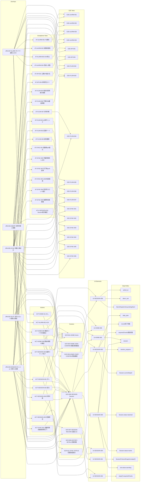

# SCR-006-SESSION マップ

```mermaid
flowchart LR
  %% SCR-006-SESSION
  subgraph JRN["Journeys"]
    N62["JRN-002-SLOT 当日スロット登録と開始"]
    N63["JRN-003-SESSION セッション進行と記録"]
    N64["JRN-004-ABORT 非常中断と再開"]
    N65["JRN-005-SYNC 同期と再試行"]
    N66["JRN-007-ALARM タイマー通知とACK"]
  end
  subgraph ACT["Actions"]
    N1["ACT-ALARM-001 ACK"]
    N2["ACT-HOME-006 確認モードで手順表示"]
    N3["ACT-HOME-008 開始/再開を確定"]
    N4["ACT-HOME-011 なし"]
    N5["ACT-SESSION-001 次へ"]
    N6["ACT-SESSION-002 戻る"]
    N7["ACT-SESSION-003 記録保存"]
    N8["ACT-SESSION-004 最終ステップ完了"]
    N9["ACT-SESSION-006 非常中断"]
    N10["ACT-SYNC-001 自動同期（起動/復帰/完了）"]
  end
  subgraph SCR["Screens"]
    N67["SCR-001-HOME Home"]
    N68["SCR-003-HOME-START-CONFIRM 開始確認"]
    N69["SCR-004-HOME-VIEW-CONFIRM 閲覧専用確認"]
    N70["SCR-006-SESSION Session"]
    N71["SCR-007-SESSION-RECORD 記録入力"]
    N72["SCR-009-HISTORY-DETAIL 記録詳細"]
    N73["SCR-011-SYNC-STATUS 同期状態表示"]
  end
  subgraph UI["UI Elements"]
    N74["UI-HOME-005"]
    N75["UI-HOME-006"]
    N76["UI-SESSION-001"]
    N77["UI-SESSION-002"]
    N78["UI-SESSION-003"]
    N79["UI-SESSION-004"]
    N80["UI-SESSION-005"]
    N81["UI-SESSION-006"]
  end
  subgraph AT["Acceptance Tests"]
    N11["AT-ALARM-001 T0通知"]
    N12["AT-ALARM-002 段階再通知"]
    N13["AT-ALARM-003 ACK停止"]
    N14["AT-ALARM-004 見逃し状態"]
    N15["AT-API-001 公開API最小化"]
    N16["AT-API-004 非暗号化キー"]
    N17["AT-FLOW-001 必須チェック"]
    N18["AT-FLOW-002 記録ゲート"]
    N19["AT-FLOW-003 直列遷移"]
    N20["AT-FLOW-004 端末内同時実行制限"]
    N21["AT-FLOW-006 予期せぬ離脱再開"]
    N22["AT-FLOW-007 非常中断"]
    N23["AT-SYNC-001 起動時pull復元"]
    N24["AT-SYNC-002 完了時push反映"]
    N25["AT-SYNC-003 LWW内部適用"]
    N26["AT-SYNC-004 同日同スロット競合"]
    N27["AT-SYNC-005 手動同期消し込み"]
    N28["AT-SYNC-006 復帰時失敗導線"]
    N29["AT-UI-SESSION-001 Session表示確認"]
  end
  subgraph E2E["E2E Tests"]
    N44["E2E-ALARM-001"]
    N45["E2E-ALARM-002"]
    N46["E2E-ALARM-003"]
    N47["E2E-ALARM-004"]
    N48["E2E-API-001"]
    N49["E2E-API-004"]
    N50["E2E-FLOW-002"]
    N51["E2E-FLOW-003"]
    N52["E2E-FLOW-004"]
    N53["E2E-FLOW-005"]
    N54["E2E-FLOW-006"]
    N55["E2E-FLOW-007"]
    N56["E2E-SYNC-001"]
    N57["E2E-SYNC-002"]
    N58["E2E-SYNC-003"]
    N59["E2E-SYNC-004"]
    N60["E2E-SYNC-005"]
    N61["E2E-SYNC-006"]
  end
  subgraph DATA["Data Paths"]
    N30["acked_at"]
    N31["alarm_ack"]
    N32["AlarmDispatchJob.pendingAlarm"]
    N33["daily_plan"]
    N34["record完了状態"]
    N35["requiredChecks達成状態"]
    N36["session"]
    N37["session_progress"]
    N38["Session.currentStepId"]
    N39["Session.status=aborted"]
    N40["Session.status=active"]
    N41["SessionProtocolSnapshot.steps[*]"]
    N42["slot.status=pending"]
    N43["steps[*].requiredChecks"]
  end
  N1 --> N70
  N1 --> N81
  N2 --> N69
  N2 --> N70
  N2 --> N75
  N3 --> N68
  N3 --> N70
  N3 --> N74
  N4 --> N67
  N5 --> N70
  N5 --> N77
  N5 --> N78
  N6 --> N70
  N7 --> N70
  N7 --> N71
  N7 --> N79
  N8 --> N67
  N8 --> N70
  N9 --> N67
  N9 --> N70
  N9 --> N80
  N10 --> N73
  N11 --> N44
  N12 --> N45
  N13 --> N46
  N14 --> N47
  N15 --> N48
  N16 --> N49
  N17 --> N53
  N18 --> N54
  N19 --> N55
  N20 --> N50
  N21 --> N51
  N22 --> N52
  N23 --> N56
  N24 --> N58
  N25 --> N59
  N26 --> N60
  N27 --> N57
  N28 --> N61
  N62 --> N2
  N62 --> N3
  N62 --> N20
  N62 --> N50
  N62 --> N67
  N62 --> N68
  N62 --> N69
  N63 --> N5
  N63 --> N6
  N63 --> N7
  N63 --> N8
  N63 --> N17
  N63 --> N18
  N63 --> N19
  N63 --> N53
  N63 --> N54
  N63 --> N55
  N63 --> N70
  N63 --> N71
  N63 --> N72
  N64 --> N9
  N64 --> N21
  N64 --> N22
  N64 --> N51
  N64 --> N52
  N64 --> N67
  N64 --> N70
  N65 --> N4
  N65 --> N10
  N65 --> N15
  N65 --> N16
  N65 --> N23
  N65 --> N24
  N65 --> N25
  N65 --> N26
  N65 --> N27
  N65 --> N28
  N65 --> N48
  N65 --> N49
  N65 --> N56
  N65 --> N57
  N65 --> N58
  N65 --> N59
  N65 --> N60
  N65 --> N61
  N65 --> N67
  N65 --> N70
  N65 --> N73
  N66 --> N1
  N66 --> N11
  N66 --> N12
  N66 --> N13
  N66 --> N14
  N66 --> N44
  N66 --> N45
  N66 --> N46
  N66 --> N47
  N66 --> N70
  N68 --> N74
  N69 --> N75
  N70 --> N76
  N70 --> N77
  N70 --> N78
  N70 --> N80
  N70 --> N81
  N71 --> N79
  N74 --> N36
  N76 --> N41
  N77 --> N43
  N78 --> N34
  N78 --> N35
  N78 --> N37
  N78 --> N38
  N80 --> N33
  N80 --> N36
  N80 --> N39
  N80 --> N40
  N80 --> N42
  N81 --> N30
  N81 --> N31
  N81 --> N32
```

