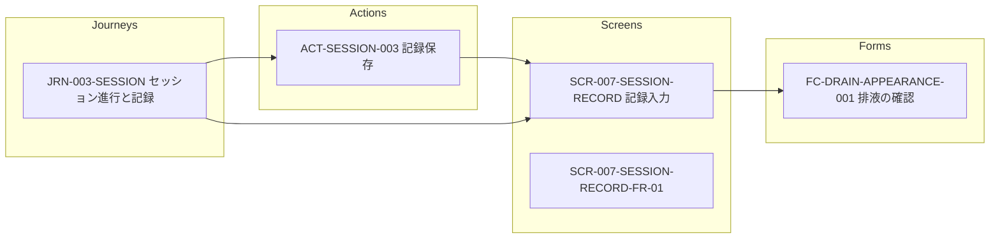

# SCR-007-SESSION-RECORD-FR-01 マップ

```mermaid
flowchart LR
  %% SCR-007-SESSION-RECORD-FR-01
  subgraph JRN["Journeys"]
    N3["JRN-003-SESSION セッション進行と記録"]
  end
  subgraph ACT["Actions"]
    N1["ACT-SESSION-003 記録保存"]
  end
  subgraph SCR["Screens"]
    N4["SCR-007-SESSION-RECORD 記録入力"]
    N5["SCR-007-SESSION-RECORD-FR-01"]
  end
  subgraph FC["Forms"]
    N2["FC-DRAIN-APPEARANCE-001 排液の確認"]
  end
  N1 --> N4
  N3 --> N1
  N3 --> N4
  N4 --> N2
```

