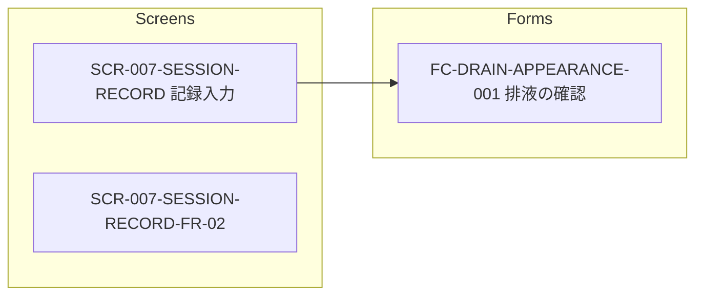

# SCR-007-SESSION-RECORD-FR-02 マップ

```mermaid
flowchart LR
  %% SCR-007-SESSION-RECORD-FR-02
  subgraph SCR["Screens"]
    N2["SCR-007-SESSION-RECORD 記録入力"]
    N3["SCR-007-SESSION-RECORD-FR-02"]
  end
  subgraph FC["Forms"]
    N1["FC-DRAIN-APPEARANCE-001 排液の確認"]
  end
  N2 --> N1
```

