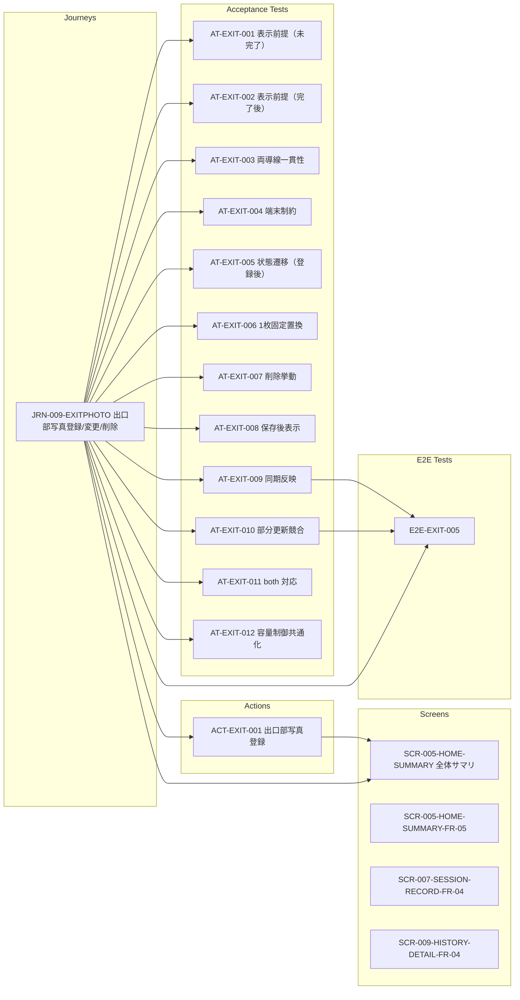

# SCR-007-SESSION-RECORD-FR-04 マップ

```mermaid
flowchart LR
  %% SCR-007-SESSION-RECORD-FR-04
  subgraph JRN["Journeys"]
    N15["JRN-009-EXITPHOTO 出口部写真登録/変更/削除"]
  end
  subgraph ACT["Actions"]
    N1["ACT-EXIT-001 出口部写真登録"]
  end
  subgraph SCR["Screens"]
    N16["SCR-005-HOME-SUMMARY 全体サマリ"]
    N17["SCR-005-HOME-SUMMARY-FR-05"]
    N18["SCR-007-SESSION-RECORD-FR-04"]
    N19["SCR-009-HISTORY-DETAIL-FR-04"]
  end
  subgraph AT["Acceptance Tests"]
    N2["AT-EXIT-001 表示前提（未完了）"]
    N3["AT-EXIT-002 表示前提（完了後）"]
    N4["AT-EXIT-003 両導線一貫性"]
    N5["AT-EXIT-004 端末制約"]
    N6["AT-EXIT-005 状態遷移（登録後）"]
    N7["AT-EXIT-006 1枚固定置換"]
    N8["AT-EXIT-007 削除挙動"]
    N9["AT-EXIT-008 保存後表示"]
    N10["AT-EXIT-009 同期反映"]
    N11["AT-EXIT-010 部分更新競合"]
    N12["AT-EXIT-011 both 対応"]
    N13["AT-EXIT-012 容量制御共通化"]
  end
  subgraph E2E["E2E Tests"]
    N14["E2E-EXIT-005"]
  end
  N1 --> N16
  N10 --> N14
  N11 --> N14
  N15 --> N1
  N15 --> N2
  N15 --> N3
  N15 --> N4
  N15 --> N5
  N15 --> N6
  N15 --> N7
  N15 --> N8
  N15 --> N9
  N15 --> N10
  N15 --> N11
  N15 --> N12
  N15 --> N13
  N15 --> N14
  N15 --> N16
```

