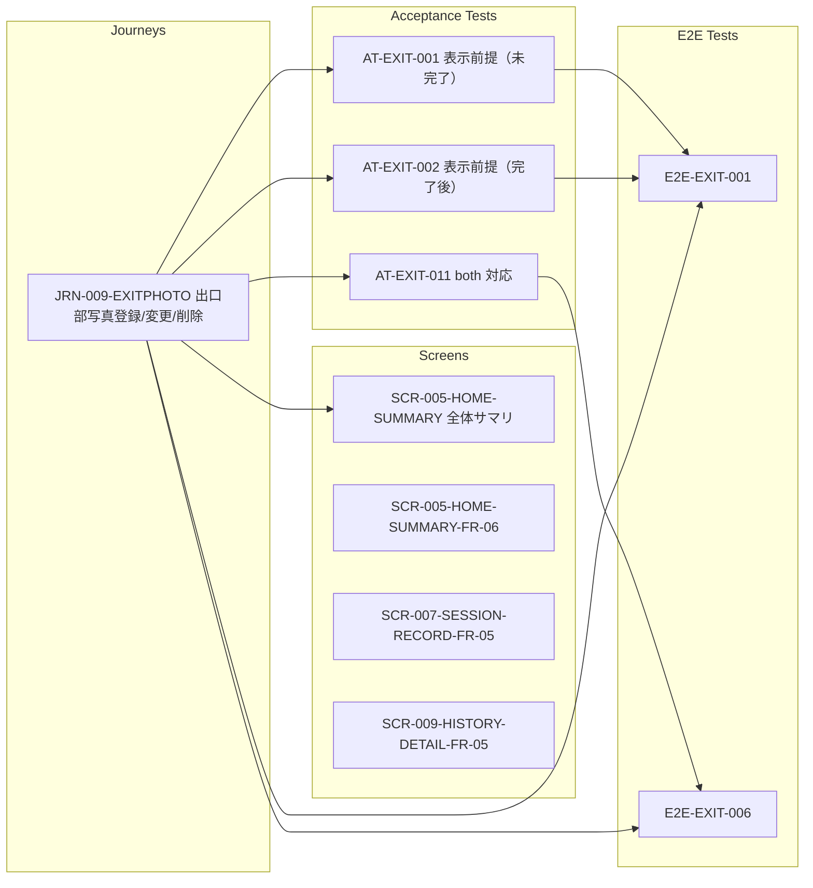

# SCR-007-SESSION-RECORD-FR-05 マップ

```mermaid
flowchart LR
  %% SCR-007-SESSION-RECORD-FR-05
  subgraph JRN["Journeys"]
    N6["JRN-009-EXITPHOTO 出口部写真登録/変更/削除"]
  end
  subgraph SCR["Screens"]
    N7["SCR-005-HOME-SUMMARY 全体サマリ"]
    N8["SCR-005-HOME-SUMMARY-FR-06"]
    N9["SCR-007-SESSION-RECORD-FR-05"]
    N10["SCR-009-HISTORY-DETAIL-FR-05"]
  end
  subgraph AT["Acceptance Tests"]
    N1["AT-EXIT-001 表示前提（未完了）"]
    N2["AT-EXIT-002 表示前提（完了後）"]
    N3["AT-EXIT-011 both 対応"]
  end
  subgraph E2E["E2E Tests"]
    N4["E2E-EXIT-001"]
    N5["E2E-EXIT-006"]
  end
  N1 --> N4
  N2 --> N4
  N3 --> N5
  N6 --> N1
  N6 --> N2
  N6 --> N3
  N6 --> N4
  N6 --> N5
  N6 --> N7
```

