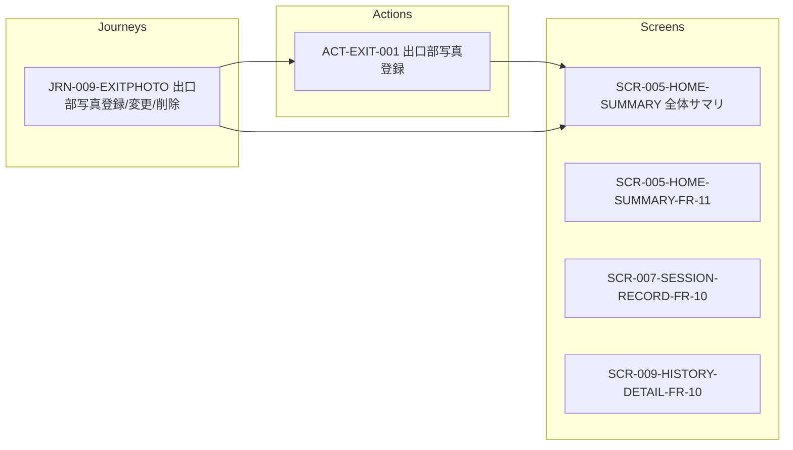

# SCR-007-SESSION-RECORD-FR-10 マップ

```mermaid
flowchart LR
  %% SCR-007-SESSION-RECORD-FR-10
  subgraph JRN["Journeys"]
    N2["JRN-009-EXITPHOTO 出口部写真登録/変更/削除"]
  end
  subgraph ACT["Actions"]
    N1["ACT-EXIT-001 出口部写真登録"]
  end
  subgraph SCR["Screens"]
    N3["SCR-005-HOME-SUMMARY 全体サマリ"]
    N4["SCR-005-HOME-SUMMARY-FR-11"]
    N5["SCR-007-SESSION-RECORD-FR-10"]
    N6["SCR-009-HISTORY-DETAIL-FR-10"]
  end
  N1 --> N3
  N2 --> N1
  N2 --> N3
```

