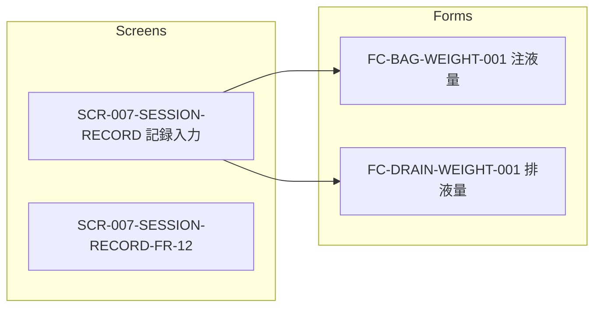

# SCR-007-SESSION-RECORD-FR-12 マップ

```mermaid
flowchart LR
  %% SCR-007-SESSION-RECORD-FR-12
  subgraph SCR["Screens"]
    N3["SCR-007-SESSION-RECORD 記録入力"]
    N4["SCR-007-SESSION-RECORD-FR-12"]
  end
  subgraph FC["Forms"]
    N1["FC-BAG-WEIGHT-001 注液量"]
    N2["FC-DRAIN-WEIGHT-001 排液量"]
  end
  N3 --> N1
  N3 --> N2
```

