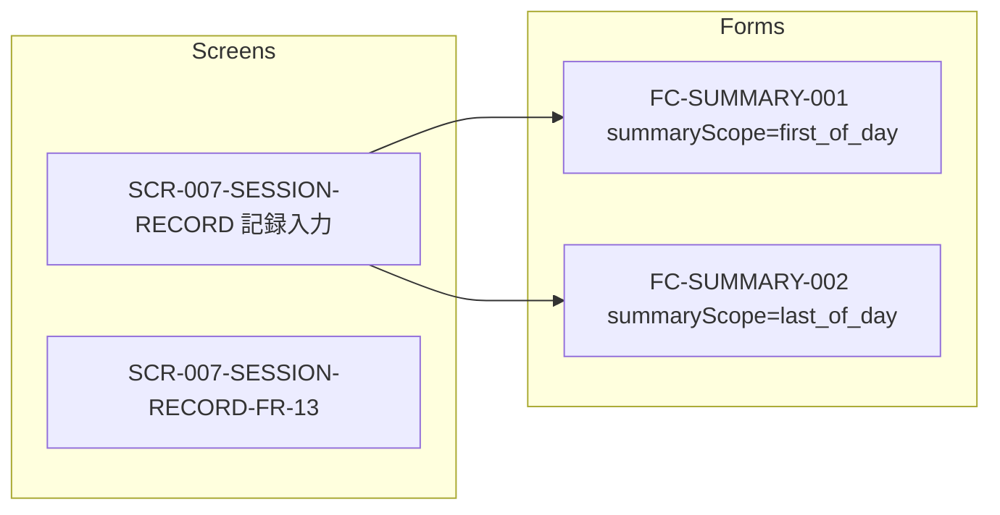

# SCR-007-SESSION-RECORD-FR-13 マップ

```mermaid
flowchart LR
  %% SCR-007-SESSION-RECORD-FR-13
  subgraph SCR["Screens"]
    N3["SCR-007-SESSION-RECORD 記録入力"]
    N4["SCR-007-SESSION-RECORD-FR-13"]
  end
  subgraph FC["Forms"]
    N1["FC-SUMMARY-001 summaryScope=first_of_day"]
    N2["FC-SUMMARY-002 summaryScope=last_of_day"]
  end
  N3 --> N1
  N3 --> N2
```

