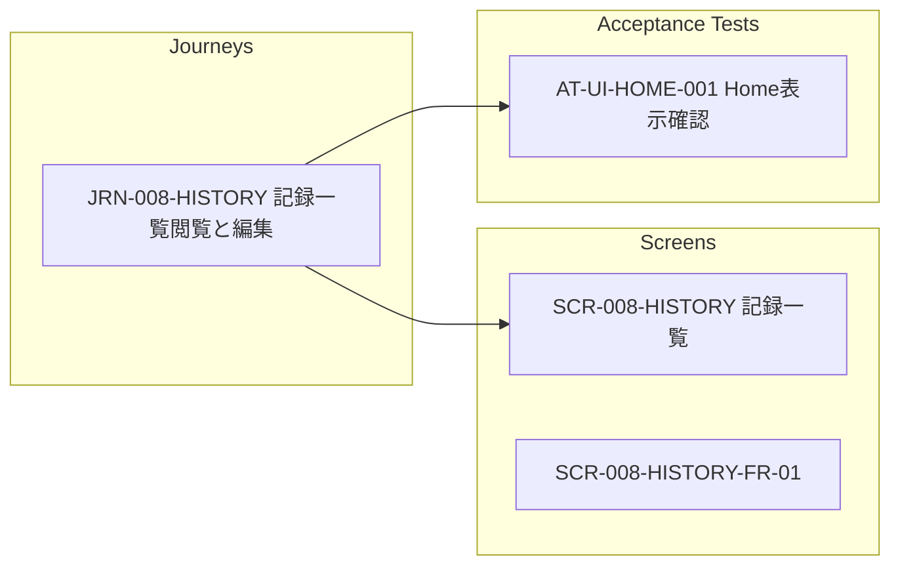

# SCR-008-HISTORY-FR-01 マップ

```mermaid
flowchart LR
  %% SCR-008-HISTORY-FR-01
  subgraph JRN["Journeys"]
    N2["JRN-008-HISTORY 記録一覧閲覧と編集"]
  end
  subgraph SCR["Screens"]
    N3["SCR-008-HISTORY 記録一覧"]
    N4["SCR-008-HISTORY-FR-01"]
  end
  subgraph AT["Acceptance Tests"]
    N1["AT-UI-HOME-001 Home表示確認"]
  end
  N2 --> N1
  N2 --> N3
```

