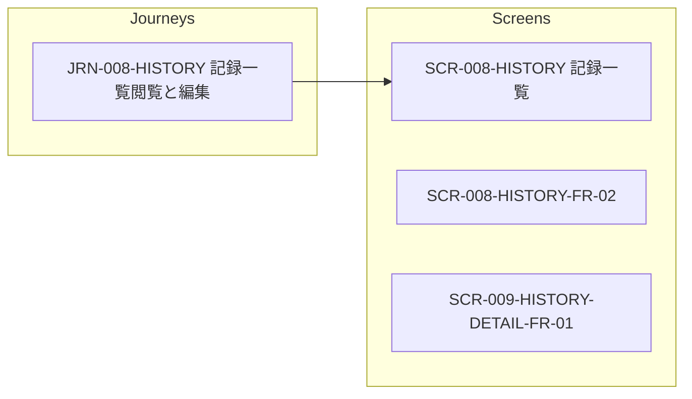

# SCR-008-HISTORY-FR-02 マップ

```mermaid
flowchart LR
  %% SCR-008-HISTORY-FR-02
  subgraph JRN["Journeys"]
    N1["JRN-008-HISTORY 記録一覧閲覧と編集"]
  end
  subgraph SCR["Screens"]
    N2["SCR-008-HISTORY 記録一覧"]
    N3["SCR-008-HISTORY-FR-02"]
    N4["SCR-009-HISTORY-DETAIL-FR-01"]
  end
  N1 --> N2
```

