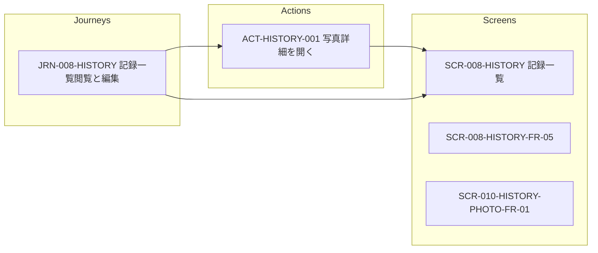

# SCR-008-HISTORY-FR-05 マップ

```mermaid
flowchart LR
  %% SCR-008-HISTORY-FR-05
  subgraph JRN["Journeys"]
    N2["JRN-008-HISTORY 記録一覧閲覧と編集"]
  end
  subgraph ACT["Actions"]
    N1["ACT-HISTORY-001 写真詳細を開く"]
  end
  subgraph SCR["Screens"]
    N3["SCR-008-HISTORY 記録一覧"]
    N4["SCR-008-HISTORY-FR-05"]
    N5["SCR-010-HISTORY-PHOTO-FR-01"]
  end
  N1 --> N3
  N2 --> N1
  N2 --> N3
```

