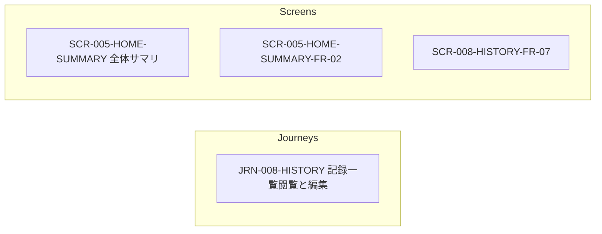

# SCR-008-HISTORY-FR-07 マップ

```mermaid
flowchart LR
  %% SCR-008-HISTORY-FR-07
  subgraph JRN["Journeys"]
    N1["JRN-008-HISTORY 記録一覧閲覧と編集"]
  end
  subgraph SCR["Screens"]
    N2["SCR-005-HOME-SUMMARY 全体サマリ"]
    N3["SCR-005-HOME-SUMMARY-FR-02"]
    N4["SCR-008-HISTORY-FR-07"]
  end
```

