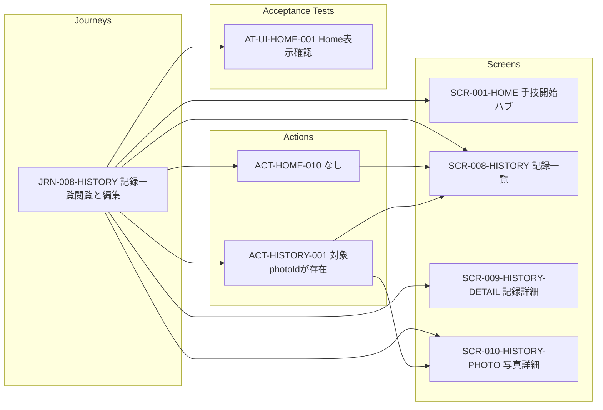

# SCR-008-HISTORY マップ

```mermaid
flowchart LR
  %% SCR-008-HISTORY
  subgraph JRN["Journeys"]
    N4["JRN-008-HISTORY 記録一覧閲覧と編集"]
  end
  subgraph ACT["Actions"]
    N1["ACT-HISTORY-001 対象photoIdが存在"]
    N2["ACT-HOME-010 なし"]
  end
  subgraph SCR["Screens"]
    N5["SCR-001-HOME 手技開始ハブ"]
    N6["SCR-008-HISTORY 記録一覧"]
    N7["SCR-009-HISTORY-DETAIL 記録詳細"]
    N8["SCR-010-HISTORY-PHOTO 写真詳細"]
  end
  subgraph AT["Acceptance Tests"]
    N3["AT-UI-HOME-001 Home表示確認"]
  end
  N1 --> N6
  N1 --> N8
  N2 --> N6
  N4 --> N1
  N4 --> N2
  N4 --> N3
  N4 --> N5
  N4 --> N6
  N4 --> N7
  N4 --> N8
```

