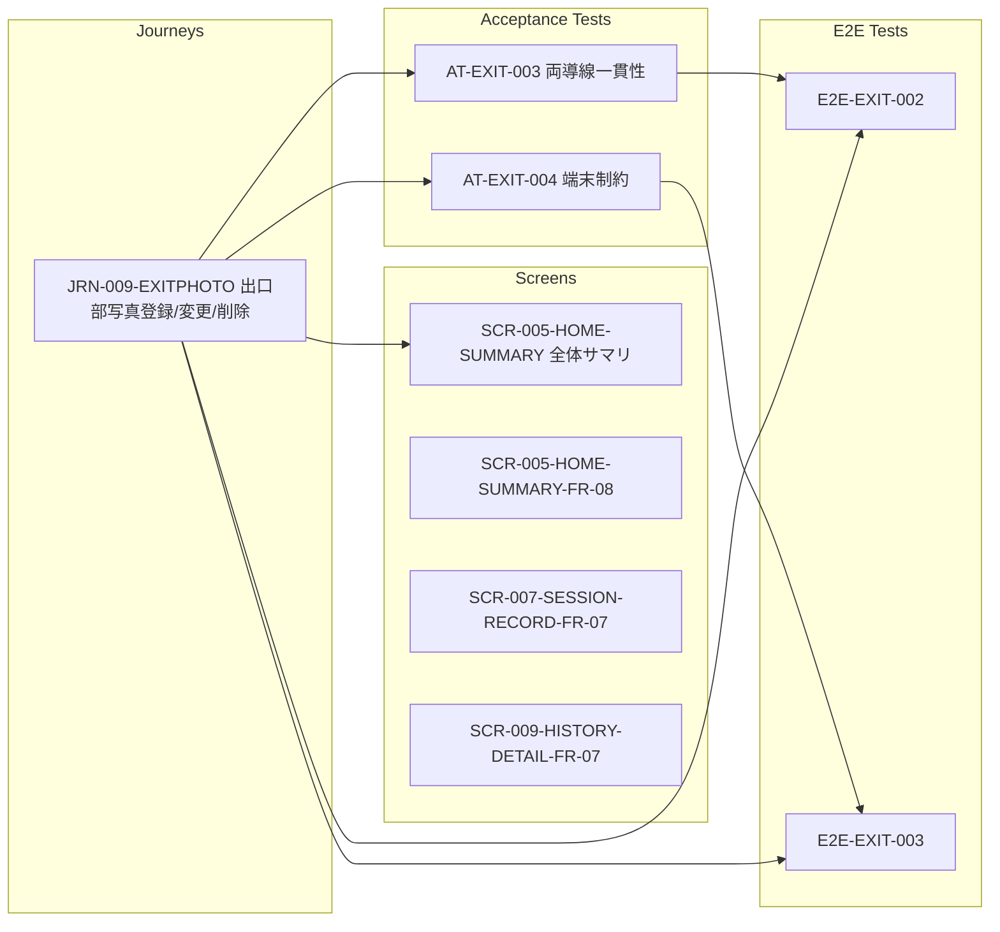

# SCR-009-HISTORY-DETAIL-FR-07 マップ

```mermaid
flowchart LR
  %% SCR-009-HISTORY-DETAIL-FR-07
  subgraph JRN["Journeys"]
    N5["JRN-009-EXITPHOTO 出口部写真登録/変更/削除"]
  end
  subgraph SCR["Screens"]
    N6["SCR-005-HOME-SUMMARY 全体サマリ"]
    N7["SCR-005-HOME-SUMMARY-FR-08"]
    N8["SCR-007-SESSION-RECORD-FR-07"]
    N9["SCR-009-HISTORY-DETAIL-FR-07"]
  end
  subgraph AT["Acceptance Tests"]
    N1["AT-EXIT-003 両導線一貫性"]
    N2["AT-EXIT-004 端末制約"]
  end
  subgraph E2E["E2E Tests"]
    N3["E2E-EXIT-002"]
    N4["E2E-EXIT-003"]
  end
  N1 --> N3
  N2 --> N4
  N5 --> N1
  N5 --> N2
  N5 --> N3
  N5 --> N4
  N5 --> N6
```

