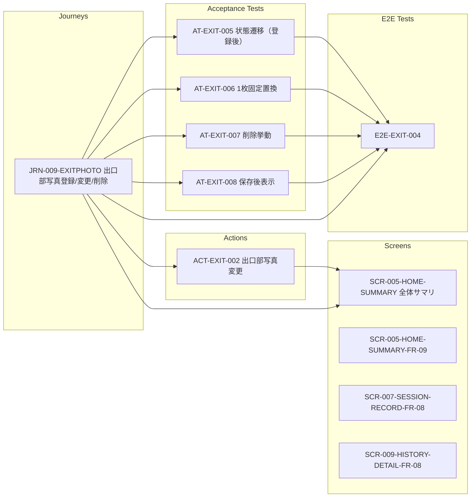

# SCR-009-HISTORY-DETAIL-FR-08 マップ

```mermaid
flowchart LR
  %% SCR-009-HISTORY-DETAIL-FR-08
  subgraph JRN["Journeys"]
    N7["JRN-009-EXITPHOTO 出口部写真登録/変更/削除"]
  end
  subgraph ACT["Actions"]
    N1["ACT-EXIT-002 出口部写真変更"]
  end
  subgraph SCR["Screens"]
    N8["SCR-005-HOME-SUMMARY 全体サマリ"]
    N9["SCR-005-HOME-SUMMARY-FR-09"]
    N10["SCR-007-SESSION-RECORD-FR-08"]
    N11["SCR-009-HISTORY-DETAIL-FR-08"]
  end
  subgraph AT["Acceptance Tests"]
    N2["AT-EXIT-005 状態遷移（登録後）"]
    N3["AT-EXIT-006 1枚固定置換"]
    N4["AT-EXIT-007 削除挙動"]
    N5["AT-EXIT-008 保存後表示"]
  end
  subgraph E2E["E2E Tests"]
    N6["E2E-EXIT-004"]
  end
  N1 --> N8
  N2 --> N6
  N3 --> N6
  N4 --> N6
  N5 --> N6
  N7 --> N1
  N7 --> N2
  N7 --> N3
  N7 --> N4
  N7 --> N5
  N7 --> N6
  N7 --> N8
```

