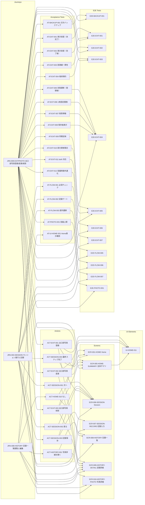

# SCR-009-HISTORY-DETAIL マップ

```mermaid
flowchart LR
  %% SCR-009-HISTORY-DETAIL
  subgraph JRN["Journeys"]
    N40["JRN-003-SESSION セッション進行と記録"]
    N41["JRN-008-HISTORY 記録一覧閲覧と編集"]
    N42["JRN-009-EXITPHOTO 出口部写真登録/変更/削除"]
  end
  subgraph ACT["Actions"]
    N1["ACT-EXIT-001 出口部写真登録"]
    N2["ACT-EXIT-002 出口部写真変更"]
    N3["ACT-EXIT-003 出口部写真削除"]
    N4["ACT-HISTORY-001 写真詳細を開く"]
    N5["ACT-HOME-010 なし"]
    N6["ACT-SESSION-001 次へ"]
    N7["ACT-SESSION-002 戻る"]
    N8["ACT-SESSION-003 記録保存"]
    N9["ACT-SESSION-004 最終ステップ完了"]
  end
  subgraph SCR["Screens"]
    N43["SCR-001-HOME Home"]
    N44["SCR-005-HOME-SUMMARY 全体サマリ"]
    N45["SCR-006-SESSION Session"]
    N46["SCR-007-SESSION-RECORD 記録入力"]
    N47["SCR-008-HISTORY 記録一覧"]
    N48["SCR-009-HISTORY-DETAIL 記録詳細"]
    N49["SCR-010-HISTORY-PHOTO 写真詳細"]
  end
  subgraph UI["UI Elements"]
    N50["UI-HOME-011"]
  end
  subgraph AT["Acceptance Tests"]
    N10["AT-BACKUP-001 日次バックアップ"]
    N11["AT-EXIT-001 表示前提（未完了）"]
    N12["AT-EXIT-002 表示前提（完了後）"]
    N13["AT-EXIT-003 両導線一貫性"]
    N14["AT-EXIT-004 端末制約"]
    N15["AT-EXIT-005 状態遷移（登録後）"]
    N16["AT-EXIT-006 1枚固定置換"]
    N17["AT-EXIT-007 削除挙動"]
    N18["AT-EXIT-008 保存後表示"]
    N19["AT-EXIT-009 同期反映"]
    N20["AT-EXIT-010 部分更新競合"]
    N21["AT-EXIT-011 both 対応"]
    N22["AT-EXIT-012 容量制御共通化"]
    N23["AT-FLOW-001 必須チェック"]
    N24["AT-FLOW-002 記録ゲート"]
    N25["AT-FLOW-003 直列遷移"]
    N26["AT-PHOTO-001 容量上限"]
    N27["AT-UI-HOME-001 Home表示確認"]
  end
  subgraph E2E["E2E Tests"]
    N28["E2E-BACKUP-001"]
    N29["E2E-EXIT-001"]
    N30["E2E-EXIT-002"]
    N31["E2E-EXIT-003"]
    N32["E2E-EXIT-004"]
    N33["E2E-EXIT-005"]
    N34["E2E-EXIT-006"]
    N35["E2E-EXIT-007"]
    N36["E2E-FLOW-005"]
    N37["E2E-FLOW-006"]
    N38["E2E-FLOW-007"]
    N39["E2E-PHOTO-001"]
  end
  N1 --> N44
  N1 --> N48
  N1 --> N50
  N2 --> N44
  N2 --> N48
  N2 --> N50
  N3 --> N44
  N3 --> N48
  N3 --> N50
  N4 --> N47
  N4 --> N49
  N5 --> N43
  N5 --> N47
  N6 --> N45
  N7 --> N45
  N8 --> N45
  N8 --> N46
  N9 --> N43
  N9 --> N45
  N10 --> N28
  N11 --> N29
  N12 --> N29
  N13 --> N30
  N14 --> N31
  N15 --> N32
  N16 --> N32
  N17 --> N32
  N18 --> N32
  N19 --> N33
  N20 --> N33
  N21 --> N34
  N22 --> N35
  N23 --> N36
  N24 --> N37
  N25 --> N38
  N26 --> N39
  N40 --> N6
  N40 --> N7
  N40 --> N8
  N40 --> N9
  N40 --> N23
  N40 --> N24
  N40 --> N25
  N40 --> N36
  N40 --> N37
  N40 --> N38
  N40 --> N45
  N40 --> N46
  N40 --> N48
  N41 --> N4
  N41 --> N5
  N41 --> N27
  N41 --> N43
  N41 --> N47
  N41 --> N48
  N41 --> N49
  N42 --> N1
  N42 --> N2
  N42 --> N3
  N42 --> N10
  N42 --> N11
  N42 --> N12
  N42 --> N13
  N42 --> N14
  N42 --> N15
  N42 --> N16
  N42 --> N17
  N42 --> N18
  N42 --> N19
  N42 --> N20
  N42 --> N21
  N42 --> N22
  N42 --> N26
  N42 --> N28
  N42 --> N29
  N42 --> N30
  N42 --> N31
  N42 --> N32
  N42 --> N33
  N42 --> N34
  N42 --> N35
  N42 --> N39
  N42 --> N44
  N42 --> N48
  N42 --> N49
  N44 --> N50
```

