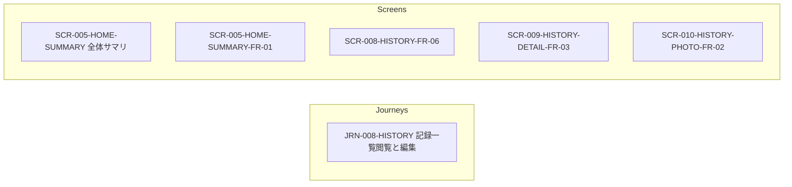

# SCR-010-HISTORY-PHOTO-FR-02 マップ

```mermaid
flowchart LR
  %% SCR-010-HISTORY-PHOTO-FR-02
  subgraph JRN["Journeys"]
    N1["JRN-008-HISTORY 記録一覧閲覧と編集"]
  end
  subgraph SCR["Screens"]
    N2["SCR-005-HOME-SUMMARY 全体サマリ"]
    N3["SCR-005-HOME-SUMMARY-FR-01"]
    N4["SCR-008-HISTORY-FR-06"]
    N5["SCR-009-HISTORY-DETAIL-FR-03"]
    N6["SCR-010-HISTORY-PHOTO-FR-02"]
  end
```

