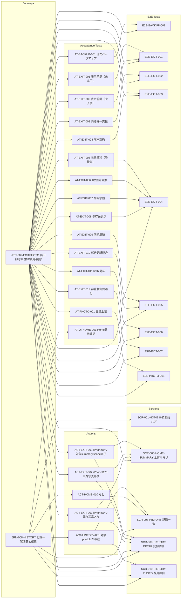

# SCR-010-HISTORY-PHOTO マップ

```mermaid
flowchart LR
  %% SCR-010-HISTORY-PHOTO
  subgraph JRN["Journeys"]
    N30["JRN-008-HISTORY 記録一覧閲覧と編集"]
    N31["JRN-009-EXITPHOTO 出口部写真登録/変更/削除"]
  end
  subgraph ACT["Actions"]
    N1["ACT-EXIT-001 iPhoneかつ対象summaryScope完了"]
    N2["ACT-EXIT-002 iPhoneかつ既存写真あり"]
    N3["ACT-EXIT-003 iPhoneかつ既存写真あり"]
    N4["ACT-HISTORY-001 対象photoIdが存在"]
    N5["ACT-HOME-010 なし"]
  end
  subgraph SCR["Screens"]
    N32["SCR-001-HOME 手技開始ハブ"]
    N33["SCR-005-HOME-SUMMARY 全体サマリ"]
    N34["SCR-008-HISTORY 記録一覧"]
    N35["SCR-009-HISTORY-DETAIL 記録詳細"]
    N36["SCR-010-HISTORY-PHOTO 写真詳細"]
  end
  subgraph AT["Acceptance Tests"]
    N6["AT-BACKUP-001 日次バックアップ"]
    N7["AT-EXIT-001 表示前提（未完了）"]
    N8["AT-EXIT-002 表示前提（完了後）"]
    N9["AT-EXIT-003 両導線一貫性"]
    N10["AT-EXIT-004 端末制約"]
    N11["AT-EXIT-005 状態遷移（登録後）"]
    N12["AT-EXIT-006 1枚固定置換"]
    N13["AT-EXIT-007 削除挙動"]
    N14["AT-EXIT-008 保存後表示"]
    N15["AT-EXIT-009 同期反映"]
    N16["AT-EXIT-010 部分更新競合"]
    N17["AT-EXIT-011 both 対応"]
    N18["AT-EXIT-012 容量制御共通化"]
    N19["AT-PHOTO-001 容量上限"]
    N20["AT-UI-HOME-001 Home表示確認"]
  end
  subgraph E2E["E2E Tests"]
    N21["E2E-BACKUP-001"]
    N22["E2E-EXIT-001"]
    N23["E2E-EXIT-002"]
    N24["E2E-EXIT-003"]
    N25["E2E-EXIT-004"]
    N26["E2E-EXIT-005"]
    N27["E2E-EXIT-006"]
    N28["E2E-EXIT-007"]
    N29["E2E-PHOTO-001"]
  end
  N1 --> N33
  N1 --> N35
  N2 --> N33
  N2 --> N35
  N3 --> N33
  N3 --> N35
  N4 --> N34
  N4 --> N36
  N5 --> N34
  N6 --> N21
  N7 --> N22
  N8 --> N22
  N9 --> N23
  N10 --> N24
  N11 --> N25
  N12 --> N25
  N13 --> N25
  N14 --> N25
  N15 --> N26
  N16 --> N26
  N17 --> N27
  N18 --> N28
  N19 --> N29
  N30 --> N4
  N30 --> N5
  N30 --> N20
  N30 --> N32
  N30 --> N34
  N30 --> N35
  N30 --> N36
  N31 --> N1
  N31 --> N2
  N31 --> N3
  N31 --> N6
  N31 --> N7
  N31 --> N8
  N31 --> N9
  N31 --> N10
  N31 --> N11
  N31 --> N12
  N31 --> N13
  N31 --> N14
  N31 --> N15
  N31 --> N16
  N31 --> N17
  N31 --> N18
  N31 --> N19
  N31 --> N21
  N31 --> N22
  N31 --> N23
  N31 --> N24
  N31 --> N25
  N31 --> N26
  N31 --> N27
  N31 --> N28
  N31 --> N29
  N31 --> N33
  N31 --> N35
  N31 --> N36
```

