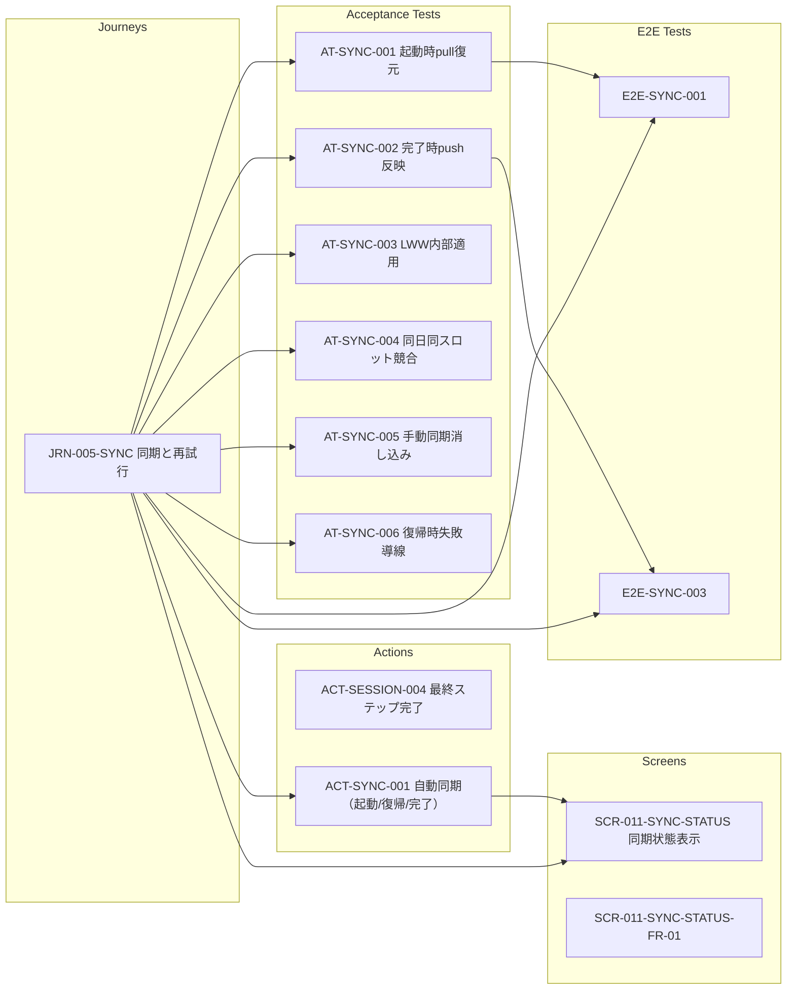

# SCR-011-SYNC-STATUS-FR-01 マップ

```mermaid
flowchart LR
  %% SCR-011-SYNC-STATUS-FR-01
  subgraph JRN["Journeys"]
    N11["JRN-005-SYNC 同期と再試行"]
  end
  subgraph ACT["Actions"]
    N1["ACT-SESSION-004 最終ステップ完了"]
    N2["ACT-SYNC-001 自動同期（起動/復帰/完了）"]
  end
  subgraph SCR["Screens"]
    N12["SCR-011-SYNC-STATUS 同期状態表示"]
    N13["SCR-011-SYNC-STATUS-FR-01"]
  end
  subgraph AT["Acceptance Tests"]
    N3["AT-SYNC-001 起動時pull復元"]
    N4["AT-SYNC-002 完了時push反映"]
    N5["AT-SYNC-003 LWW内部適用"]
    N6["AT-SYNC-004 同日同スロット競合"]
    N7["AT-SYNC-005 手動同期消し込み"]
    N8["AT-SYNC-006 復帰時失敗導線"]
  end
  subgraph E2E["E2E Tests"]
    N9["E2E-SYNC-001"]
    N10["E2E-SYNC-003"]
  end
  N2 --> N12
  N3 --> N9
  N4 --> N10
  N11 --> N2
  N11 --> N3
  N11 --> N4
  N11 --> N5
  N11 --> N6
  N11 --> N7
  N11 --> N8
  N11 --> N9
  N11 --> N10
  N11 --> N12
```

