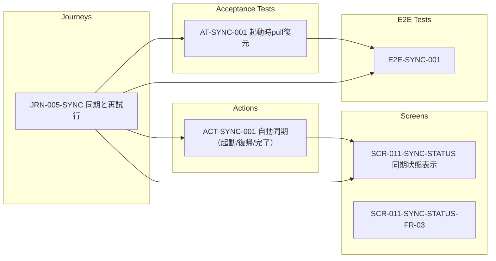

# SCR-011-SYNC-STATUS-FR-03 マップ

```mermaid
flowchart LR
  %% SCR-011-SYNC-STATUS-FR-03
  subgraph JRN["Journeys"]
    N4["JRN-005-SYNC 同期と再試行"]
  end
  subgraph ACT["Actions"]
    N1["ACT-SYNC-001 自動同期（起動/復帰/完了）"]
  end
  subgraph SCR["Screens"]
    N5["SCR-011-SYNC-STATUS 同期状態表示"]
    N6["SCR-011-SYNC-STATUS-FR-03"]
  end
  subgraph AT["Acceptance Tests"]
    N2["AT-SYNC-001 起動時pull復元"]
  end
  subgraph E2E["E2E Tests"]
    N3["E2E-SYNC-001"]
  end
  N1 --> N5
  N2 --> N3
  N4 --> N1
  N4 --> N2
  N4 --> N3
  N4 --> N5
```

