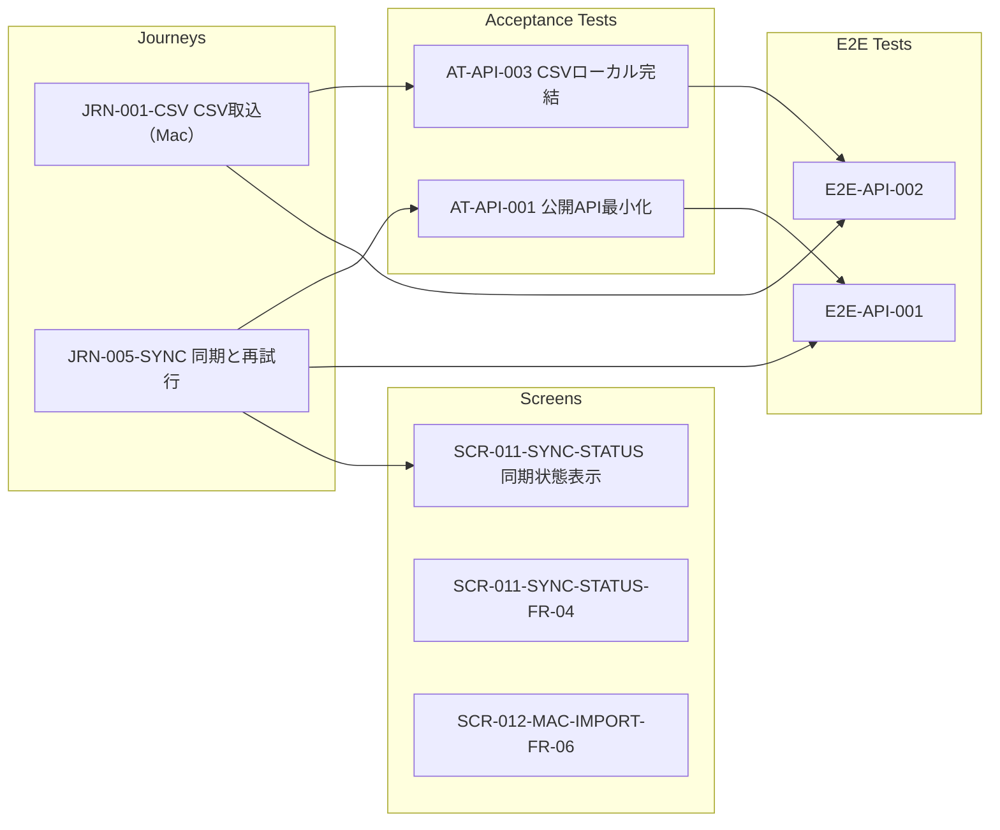

# SCR-011-SYNC-STATUS-FR-04 マップ

```mermaid
flowchart LR
  %% SCR-011-SYNC-STATUS-FR-04
  subgraph JRN["Journeys"]
    N5["JRN-001-CSV CSV取込（Mac）"]
    N6["JRN-005-SYNC 同期と再試行"]
  end
  subgraph SCR["Screens"]
    N7["SCR-011-SYNC-STATUS 同期状態表示"]
    N8["SCR-011-SYNC-STATUS-FR-04"]
    N9["SCR-012-MAC-IMPORT-FR-06"]
  end
  subgraph AT["Acceptance Tests"]
    N1["AT-API-001 公開API最小化"]
    N2["AT-API-003 CSVローカル完結"]
  end
  subgraph E2E["E2E Tests"]
    N3["E2E-API-001"]
    N4["E2E-API-002"]
  end
  N1 --> N3
  N2 --> N4
  N5 --> N2
  N5 --> N4
  N6 --> N1
  N6 --> N3
  N6 --> N7
```

