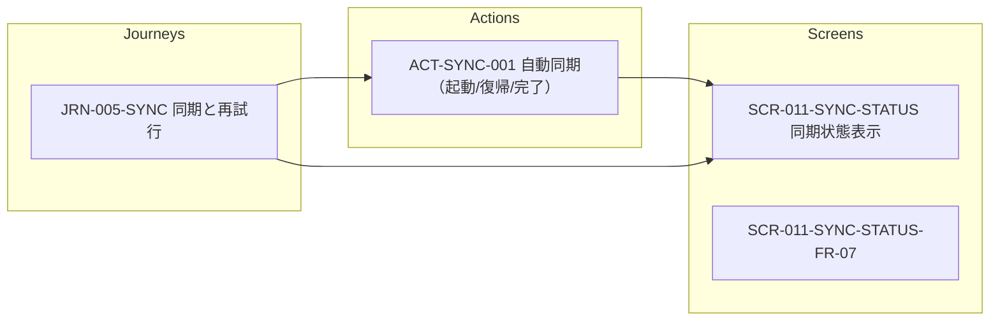

# SCR-011-SYNC-STATUS-FR-07 マップ

```mermaid
flowchart LR
  %% SCR-011-SYNC-STATUS-FR-07
  subgraph JRN["Journeys"]
    N2["JRN-005-SYNC 同期と再試行"]
  end
  subgraph ACT["Actions"]
    N1["ACT-SYNC-001 自動同期（起動/復帰/完了）"]
  end
  subgraph SCR["Screens"]
    N3["SCR-011-SYNC-STATUS 同期状態表示"]
    N4["SCR-011-SYNC-STATUS-FR-07"]
  end
  N1 --> N3
  N2 --> N1
  N2 --> N3
```

