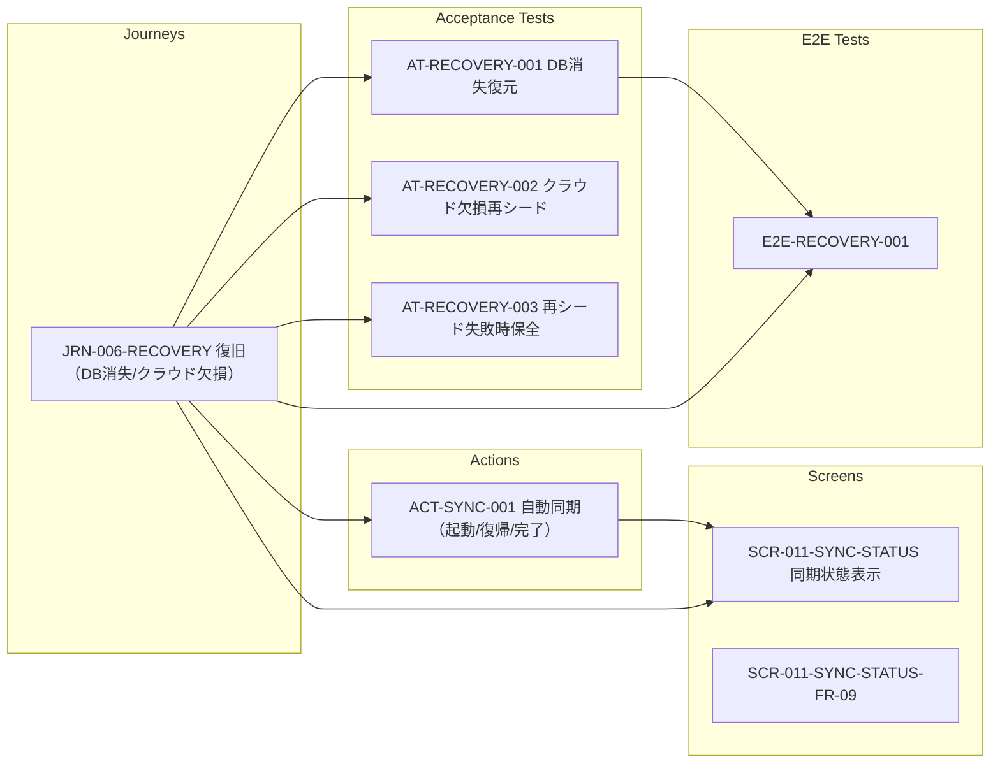

# SCR-011-SYNC-STATUS-FR-09 マップ

```mermaid
flowchart LR
  %% SCR-011-SYNC-STATUS-FR-09
  subgraph JRN["Journeys"]
    N6["JRN-006-RECOVERY 復旧（DB消失/クラウド欠損）"]
  end
  subgraph ACT["Actions"]
    N1["ACT-SYNC-001 自動同期（起動/復帰/完了）"]
  end
  subgraph SCR["Screens"]
    N7["SCR-011-SYNC-STATUS 同期状態表示"]
    N8["SCR-011-SYNC-STATUS-FR-09"]
  end
  subgraph AT["Acceptance Tests"]
    N2["AT-RECOVERY-001 DB消失復元"]
    N3["AT-RECOVERY-002 クラウド欠損再シード"]
    N4["AT-RECOVERY-003 再シード失敗時保全"]
  end
  subgraph E2E["E2E Tests"]
    N5["E2E-RECOVERY-001"]
  end
  N1 --> N7
  N2 --> N5
  N6 --> N1
  N6 --> N2
  N6 --> N3
  N6 --> N4
  N6 --> N5
  N6 --> N7
```

