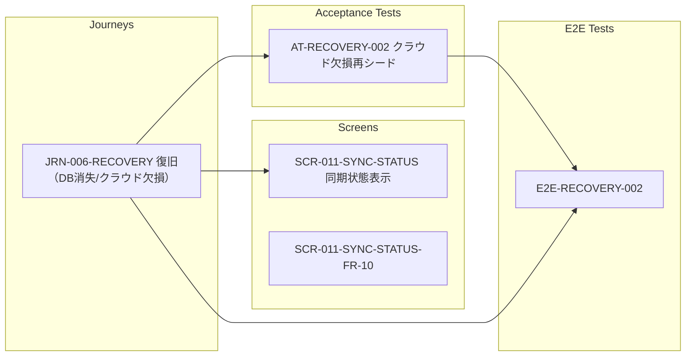

# SCR-011-SYNC-STATUS-FR-10 マップ

```mermaid
flowchart LR
  %% SCR-011-SYNC-STATUS-FR-10
  subgraph JRN["Journeys"]
    N3["JRN-006-RECOVERY 復旧（DB消失/クラウド欠損）"]
  end
  subgraph SCR["Screens"]
    N4["SCR-011-SYNC-STATUS 同期状態表示"]
    N5["SCR-011-SYNC-STATUS-FR-10"]
  end
  subgraph AT["Acceptance Tests"]
    N1["AT-RECOVERY-002 クラウド欠損再シード"]
  end
  subgraph E2E["E2E Tests"]
    N2["E2E-RECOVERY-002"]
  end
  N1 --> N2
  N3 --> N1
  N3 --> N2
  N3 --> N4
```

