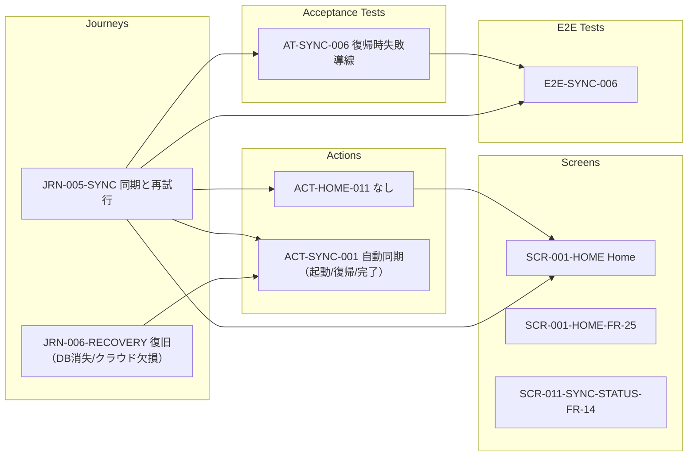

# SCR-011-SYNC-STATUS-FR-14 マップ

```mermaid
flowchart LR
  %% SCR-011-SYNC-STATUS-FR-14
  subgraph JRN["Journeys"]
    N5["JRN-005-SYNC 同期と再試行"]
    N6["JRN-006-RECOVERY 復旧（DB消失/クラウド欠損）"]
  end
  subgraph ACT["Actions"]
    N1["ACT-HOME-011 なし"]
    N2["ACT-SYNC-001 自動同期（起動/復帰/完了）"]
  end
  subgraph SCR["Screens"]
    N7["SCR-001-HOME Home"]
    N8["SCR-001-HOME-FR-25"]
    N9["SCR-011-SYNC-STATUS-FR-14"]
  end
  subgraph AT["Acceptance Tests"]
    N3["AT-SYNC-006 復帰時失敗導線"]
  end
  subgraph E2E["E2E Tests"]
    N4["E2E-SYNC-006"]
  end
  N1 --> N7
  N3 --> N4
  N5 --> N1
  N5 --> N2
  N5 --> N3
  N5 --> N4
  N5 --> N7
  N6 --> N2
```

