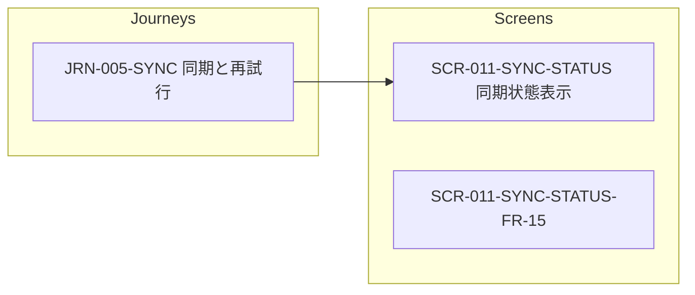

# SCR-011-SYNC-STATUS-FR-15 マップ

```mermaid
flowchart LR
  %% SCR-011-SYNC-STATUS-FR-15
  subgraph JRN["Journeys"]
    N1["JRN-005-SYNC 同期と再試行"]
  end
  subgraph SCR["Screens"]
    N2["SCR-011-SYNC-STATUS 同期状態表示"]
    N3["SCR-011-SYNC-STATUS-FR-15"]
  end
  N1 --> N2
```

