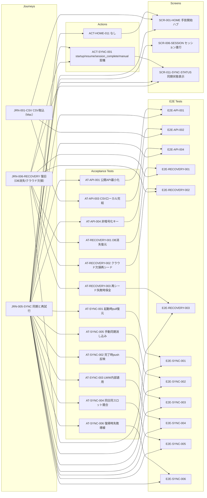

# SCR-011-SYNC-STATUS マップ

```mermaid
flowchart LR
  %% SCR-011-SYNC-STATUS
  subgraph JRN["Journeys"]
    N27["JRN-001-CSV CSV取込（Mac）"]
    N28["JRN-005-SYNC 同期と再試行"]
    N29["JRN-006-RECOVERY 復旧（DB消失/クラウド欠損）"]
  end
  subgraph ACT["Actions"]
    N1["ACT-HOME-011 なし"]
    N2["ACT-SYNC-001 startup/resume/session_complete/manual 契機"]
  end
  subgraph SCR["Screens"]
    N30["SCR-001-HOME 手技開始ハブ"]
    N31["SCR-006-SESSION セッション進行"]
    N32["SCR-011-SYNC-STATUS 同期状態表示"]
  end
  subgraph AT["Acceptance Tests"]
    N3["AT-API-001 公開API最小化"]
    N4["AT-API-003 CSVローカル完結"]
    N5["AT-API-004 非暗号化キー"]
    N6["AT-RECOVERY-001 DB消失復元"]
    N7["AT-RECOVERY-002 クラウド欠損再シード"]
    N8["AT-RECOVERY-003 再シード失敗時保全"]
    N9["AT-SYNC-001 起動時pull復元"]
    N10["AT-SYNC-002 完了時push反映"]
    N11["AT-SYNC-003 LWW内部適用"]
    N12["AT-SYNC-004 同日同スロット競合"]
    N13["AT-SYNC-005 手動同期消し込み"]
    N14["AT-SYNC-006 復帰時失敗導線"]
  end
  subgraph E2E["E2E Tests"]
    N15["E2E-API-001"]
    N16["E2E-API-002"]
    N17["E2E-API-004"]
    N18["E2E-RECOVERY-001"]
    N19["E2E-RECOVERY-002"]
    N20["E2E-RECOVERY-003"]
    N21["E2E-SYNC-001"]
    N22["E2E-SYNC-002"]
    N23["E2E-SYNC-003"]
    N24["E2E-SYNC-004"]
    N25["E2E-SYNC-005"]
    N26["E2E-SYNC-006"]
  end
  N1 --> N30
  N2 --> N32
  N3 --> N15
  N4 --> N16
  N5 --> N17
  N6 --> N18
  N7 --> N19
  N8 --> N20
  N9 --> N21
  N10 --> N23
  N11 --> N24
  N12 --> N25
  N13 --> N22
  N14 --> N26
  N27 --> N4
  N27 --> N16
  N27 --> N30
  N28 --> N1
  N28 --> N2
  N28 --> N3
  N28 --> N5
  N28 --> N9
  N28 --> N10
  N28 --> N11
  N28 --> N12
  N28 --> N13
  N28 --> N14
  N28 --> N15
  N28 --> N17
  N28 --> N21
  N28 --> N22
  N28 --> N23
  N28 --> N24
  N28 --> N25
  N28 --> N26
  N28 --> N30
  N28 --> N31
  N28 --> N32
  N29 --> N2
  N29 --> N6
  N29 --> N7
  N29 --> N8
  N29 --> N18
  N29 --> N19
  N29 --> N20
  N29 --> N32
```

