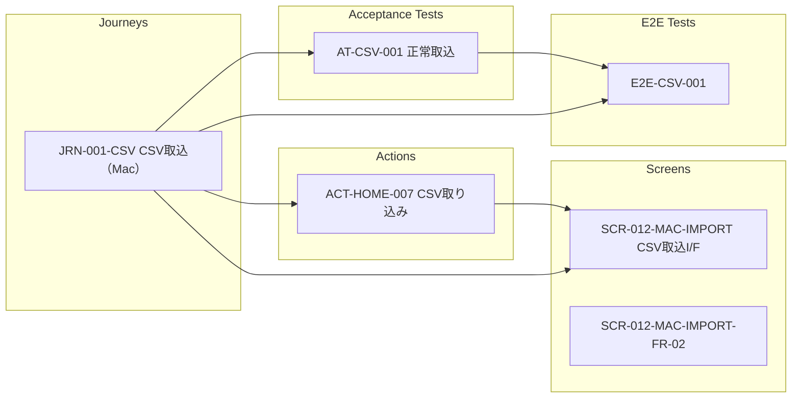

# SCR-012-MAC-IMPORT-FR-02 マップ

```mermaid
flowchart LR
  %% SCR-012-MAC-IMPORT-FR-02
  subgraph JRN["Journeys"]
    N4["JRN-001-CSV CSV取込（Mac）"]
  end
  subgraph ACT["Actions"]
    N1["ACT-HOME-007 CSV取り込み"]
  end
  subgraph SCR["Screens"]
    N5["SCR-012-MAC-IMPORT CSV取込I/F"]
    N6["SCR-012-MAC-IMPORT-FR-02"]
  end
  subgraph AT["Acceptance Tests"]
    N2["AT-CSV-001 正常取込"]
  end
  subgraph E2E["E2E Tests"]
    N3["E2E-CSV-001"]
  end
  N1 --> N5
  N2 --> N3
  N4 --> N1
  N4 --> N2
  N4 --> N3
  N4 --> N5
```

