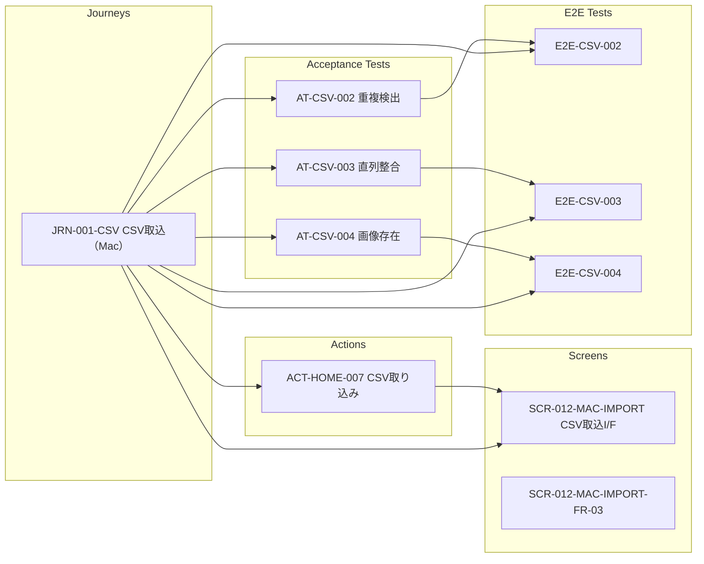

# SCR-012-MAC-IMPORT-FR-03 マップ

```mermaid
flowchart LR
  %% SCR-012-MAC-IMPORT-FR-03
  subgraph JRN["Journeys"]
    N8["JRN-001-CSV CSV取込（Mac）"]
  end
  subgraph ACT["Actions"]
    N1["ACT-HOME-007 CSV取り込み"]
  end
  subgraph SCR["Screens"]
    N9["SCR-012-MAC-IMPORT CSV取込I/F"]
    N10["SCR-012-MAC-IMPORT-FR-03"]
  end
  subgraph AT["Acceptance Tests"]
    N2["AT-CSV-002 重複検出"]
    N3["AT-CSV-003 直列整合"]
    N4["AT-CSV-004 画像存在"]
  end
  subgraph E2E["E2E Tests"]
    N5["E2E-CSV-002"]
    N6["E2E-CSV-003"]
    N7["E2E-CSV-004"]
  end
  N1 --> N9
  N2 --> N5
  N3 --> N6
  N4 --> N7
  N8 --> N1
  N8 --> N2
  N8 --> N3
  N8 --> N4
  N8 --> N5
  N8 --> N6
  N8 --> N7
  N8 --> N9
```

